# 🚀 생각 vs 실행 점수 기반 나만의 AI 실행 코치 대시보드
## (Full-Stack AI Execution Coach & Final Project Report)

> 사용자의 실제 행동 점수를 시계열(Time-Series)로 누적 추적하고, 정량적 통계 분석(Pandas)과 LLM 컨텍스트 주입 및 도구 호출(Function Calling)을 결합하여 '생각과 실행' 사이의 인지적 격차(Knowing-Doing Gap)를 줄여주는 풀스택 실행 코칭 대시보드입니다.

---

## 📌 1. 프로젝트 개요 및 서비스 소개

* **프로젝트명**: 생각 vs 실행 점수 기반 나만의 AI 실행 코치 대시보드
* **개발 기간**: 2026.09.15 ~ 2026.09.22
* **개발자 / 작성자**: 정형경
* **서비스 소개 (무엇을 해결하는가?)**:
  * **문제 정의**: 많은 사람들이 목표를 세우고 고민(생각)하는 데 많은 에너지를 쓰지만, 실제 행동(실행)으로 옮기지 못하는 '생각 vs 실행'의 불일치 문제를 겪습니다.
  * **해결 방안**:
    1. 매일의 실행 점수(0~100점)와 회고 메모를 시계열로 기록 및 관리(CRUD)합니다.
    2. 100일 이상의 누적 데이터를 Pandas로 실시간 가공하여 이동 평균(7일/30일) 및 실행 추세를 진단합니다.
    3. AI 실행 코치가 사용자의 정량적 통계 지표를 근거로 직설적인 피드백과 오늘 즉시 실행 가능한 **15분 단위 초소형 액션 플랜**을 제시합니다.
    4. 지능형 Function Calling을 통해 질문 의도에 따라 AI가 내부 통계 도구를 능동적으로 호출합니다.

---

## 🌐 2. 배포 URL 및 엔드포인트 현황

* **프론트엔드 웹 대시보드 (Vercel)**: https://execution-coach-25e5lk54b-mind-mate1.vercel.app/
* **백엔드 API 서버 (Render)**: https://execution-coach.onrender.com
* **대화형 API 문서 (Swagger UI)**: https://execution-coach.onrender.com/docs
* **OpenAPI 표준 스펙 (GPT Actions / MCP 호환)**: https://execution-coach.onrender.com/openapi.json

---

## 🏗️ 3. 시스템 아키텍처 및 기술 스택 명세

### 3.1 시스템 아키텍처 다이어그램
```text
  [ Client Tier ]
  ┌────────────────────────────────────────────────────────┐
  │  Vercel 배포 SPA 대시보드 (HTML5 / Vanilla JS / CSS3)  │
  │  - Chart.js 시계열 꺾은선 차트 시각화                   │
  │  - 다크 모드 토글 (Dark/Light Mode)                    │
  │  - CSV 데이터 내보내기 & 실시간 대화 세션 관리         │
  └───────────────────────────┬────────────────────────────┘
                              │ HTTPS / REST API (CORS 허용)
                              ▼
  [ Application Tier ]
  ┌────────────────────────────────────────────────────────┐
  │  Render 클라우드 배포 백엔드 (FastAPI / Python 3.14)   │
  │  - Uvicorn 기반 비동기 ASGI 고성능 서버 구동           │
  │  - Pydantic v2 데이터 유효성 검증 & 통계 스키마 처리   │
  │  - OpenAPI 규격 자동 생성 (/docs, /openapi.json)       │
  └─────────────┬────────────────────────────┬─────────────┘
                │                            │
                ▼                            ▼
  [ Database Tier ]            [ AI Analytics Engine ]
  ┌────────────────────────┐   ┌───────────────────────────────┐
  │ Firebase Firestore     │   │ 1. Pandas 시계열 통계 엔진    │
  │ - execution_logs       │   │    - 7일/30일 이동평균, 추세  │
  │   (시계열 102건 적재)  │   │ 2. OpenAI LLM (gpt-5.4-mini)  │
  │ - conversations        │   │    - Context Injection 코칭   │
  │   (영구 대화 세션)     │   │    - Function Calling 도구 호출│
  └────────────────────────┘   └───────────────────────────────┘
```

### 3.2 계층별 상세 기술 스택
| 계층 (Layer) | 사용 기술 | 적용 목적 및 주요 역할 |
| :--- | :--- | :--- |
| **Frontend** | HTML5, JavaScript (ES6+), CSS3 | 반응형 싱글 페이지(SPA), 모바일/데스크톱 적응형 레이아웃 |
| **Data Viz & UX** | Chart.js | 최근 14일 시계열 실행 점수 꺾은선 추이 그래프 렌더링 |
| **Backend (Framework)** | Python 3.14, FastAPI | 비동기 고성능 RESTful API 라우팅, Swagger 및 OpenAPI 표준 자동 연동 |
| **Backend (ASGI Server)** | Uvicorn | `uvloop` 기반 초고속 비동기 ASGI 웹 서버로, 클라이언트의 논블로킹(Non-blocking) I/O 동시 요청을 처리하고 Render 컨테이너 환경에서 `$PORT`를 안전하게 바인딩하여 무중단 서빙 수행 |
| **Validation & Schema** | Pydantic v2 | 입출력 데이터 무결성 검증 및 런타임 타입 검사, 통계 요약(`summary`) 및 CRUD 요청/응답 스키마를 정의하여 비정상 데이터의 유입을 인입점에서 422 에러로 사전 차단 |
| **Database** | Firebase Cloud Firestore | NoSQL 문서 기반 영구 데이터 저장소 (`execution_logs`, `conversations`) |
| **Data Analytics** | Pandas, NumPy | 시계열 데이터 정렬, 7일/30일 이동평균 연산, 직전 대비 추세 판정 |
| **AI & LLM** | OpenAI API (`gpt-5.4-mini`) | 맞춤형 시스템 프롬프트 주입 및 Tool/Function Calling 처리 |
| **배포 및 CI/CD** | Render, Vercel, GitHub Actions | 백엔드 컨테이너 빌드 및 프론트엔드 정적 호스팅 자동화 (CI/CD) |

---

## 💻 4. 환경 변수 및 로컬 실행 가이드

### 4.1 환경 변수 목록 (`.env`)
| 환경 변수명 | 설명 | 예시 값 |
| :--- | :--- | :--- |
| `FIREBASE_CREDENTIALS_PATH` | Firebase 서비스 계정 키 파일 경로 | `./serviceAccountKey.json` |
| `OPENAI_API_KEY` | OpenAI API 인증 키 | `sk-...` |
| `OPENAI_BASE_URL` | OpenAI API 베이스 URL (프록시 사용 시) | `https://api.openai.com/v1` |
| `OPENAI_MODEL` | 사용할 LLM 모델 식별자 | `gpt-5.4-mini` |
| `CORS_ORIGINS` | CORS 허용 오리진 리스트 | `*` 또는 `https://execution-coach-25e5lk54b-mind-mate1.vercel.app` |
| `PORT` | 백엔드 서버 구동 포트 | `10000` (Render 기본값) |

### 4.2 로컬 설치 및 Uvicorn 실행 명령어 코드
```bash
# 1. 저장소 복제 및 가상환경 설정
git clone [https://github.com/](https://github.com/)<사용자-계정>/<저장소-이름>.git
cd <저장소-이름>
python -m venv venv
# Windows
.\venv\Scripts\activate
# Mac / Linux
source venv/bin/activate

# 2. 필수 라이브러리 설치
pip install -r requirements.txt

# 3. 100일 시계열 데이터 생성 및 업로드
python generate_seed.py
python upload_seed.py

# 4. Uvicorn 로컬 개발 서버 구동 (코드 변경 시 자동 재로드: --reload)
uvicorn main:app --host 0.0.0.0 --port 8000 --reload

# [참고] Render 클라우드 프로덕션 배포 시 Uvicorn 구동 명령어
# uvicorn main:app --host 0.0.0.0 --port $PORT
```
브라우저에서 `http://localhost:8000` 접속 시 메인 대시보드가 정상 렌더링됩니다.

---

## ⚙️ 5. 핵심 기능 구현 및 검증 결과

### 5.1 시계열 데이터 관리 (CRUD)
* **Create (`POST /api/data`)**: 일자(`YYYY-MM-DD`), 실행 점수(`0~100`), 회고 메모를 입력받아 Firestore의 `execution_logs` 컬렉션에 적재.
* **Read (`GET /api/data`, `GET /api/data/{id}`)**: 전체 102건의 시계열 목록 또는 특정 날짜의 단건 로그를 일자순 정렬하여 반환.
* **Update (`PUT /api/data/{id}`)**: 특정 날짜의 점수 및 메모를 수정하고 갱신된 데이터를 `200 OK`로 반환 (Swagger 및 화면 바인딩 검증 완료).
* **Delete (`DELETE /api/data/{id}`)**: 불필요한 시계열 기록을 식별자 기반으로 안전하게 삭제.

### 5.2 시계열 통계 분석 엔진 (Pandas)
* **엔드포인트**: `GET /api/data/summary` (별칭: `/api/analytics`)
* **산출 지표**:
  * `period`: 전체 기록 기간 (`2026-06-09 ~ 2026-09-22`)
  * `total_count`: 총 기록 건수 (`102건`)
  * `overall_mean`: 누적 전체 평균 점수 (`66.9점` ~ `67.0점`)
  * `recent_7_mean` / `recent_30_mean`: 최근 7일(`69.9점` ~ `71.3점`) 및 30일(`72.0점`) 단기/중기 이동평균
  * `max_value` / `min_value`: 최대값(`95점`), 최저값(`44점`)
  * `trend`: 직전 주차 대비 변화량에 따른 추세 판정 (`상승세`, `하강세`, `안정적`)

### 5.3 데이터 기반 AI 실행 코칭 및 대화 영구 보존
* **엔드포인트**: `POST /api/chat` (별칭: `/api/coach`)
* **동작 메커니즘**:
  1. 클라이언트 질의 접수 시 최신 데이터 요약 통계와 최근 7일간의 상세 로그를 시스템 프롬프트에 자동 주입(Context Injection).
  2. 추상적 공감이 아닌 정량 수치 기반 진단 및 '오늘 즉시 착수 가능한 15분 단위 액션' 도출.
  3. `conversations` 컬렉션에 문답 히스토리를 세션 ID 단위로 자동 업데이트하여 영구 보존.

---

## 💻 6. 핵심 코드 및 세부 구현 상세

### 6.1 Pydantic 기반 데이터 스키마 모델링 (`main.py`)
```python
from typing import List, Optional
from pydantic import BaseModel, Field

# 1. 일일 실행 로그 생성 검증 스키마
class ExecutionLogCreate(BaseModel):
    date: str = Field(..., pattern=r"^\d{4}-\d{2}-\d{2}$", description="기록 날짜 (YYYY-MM-DD)")
    value: int = Field(..., ge=0, le=100, description="실행 점수 (0~100점)")
    memo: str = Field(..., min_length=1, max_length=500, description="실행 내용 및 고민 메모")

# 2. 일일 실행 로그 수정 스키마
class ExecutionLogUpdate(BaseModel):
    value: Optional[int] = Field(None, ge=0, le=100, description="수정할 실행 점수 (0~100점)")
    memo: Optional[str] = Field(None, min_length=1, max_length=500, description="수정할 실행 내용 및 메모")

# 3. Pydantic 기반 시계열 통계 요약 (Data Summary) 응답 스키마
class DataSummaryResponse(BaseModel):
    period: str = Field(..., description="분석 데이터 수집 기간")
    total_count: int = Field(..., ge=0, description="총 누적 데이터 건수")
    overall_mean: float = Field(..., description="전체 누적 평균 점수")
    recent_7_mean: float = Field(..., description="최근 7일 이동평균 점수")
    recent_30_mean: float = Field(..., description="최근 30일 이동평균 점수")
    max_value: int = Field(..., description="최대 실행 점수")
    min_value: int = Field(..., description="최저 실행 점수")
    trend: str = Field(..., description="직전 주차 대비 실행 추세 판정 (상승세/하강세/안정적)")

# 4. AI 코칭 질의 검증 스키마
class ChatRequest(BaseModel):
    user_query: str = Field(
        default="최근 내 실행 상태를 바탕으로 오늘 집중해야 할 한 가지 피드백을 줘.",
        description="사용자 질문 또는 고민"
    )
    conversation_id: Optional[str] = Field(None, description="기존 대화 세션 ID (없으면 자동 생성)")

# 5. 대화 세션 아카이브 스키마
class MessageItem(BaseModel):
    role: str = Field(..., description="user 또는 assistant")
    content: str = Field(..., description="메시지 본문")
    timestamp: Optional[str] = None

class ConversationCreate(BaseModel):
    title: Optional[str] = "새로운 코칭 대화"
    messages: List[MessageItem] = []
```

### 6.2 100일 시계열 시드 데이터 자동 적재 스크립트 (`upload_seed.py`)
```python
from datetime import datetime, timedelta
import os
import random
from dotenv import load_dotenv
import firebase_admin
from firebase_admin import credentials, firestore

load_dotenv()
FIREBASE_KEY_PATH = os.getenv("FIREBASE_CREDENTIALS_PATH", "./serviceAccountKey.json")
if not firebase_admin._apps:
    cred = credentials.Certificate(FIREBASE_KEY_PATH)
    firebase_admin.initialize_app(cred)

db = firestore.client()
COLLECTION_NAME = "execution_logs"

memos = [
    "계획 수립에 너무 많은 시간을 씀. 착수가 늦어짐.",
    "생각보다 손이 먼저 움직임. 테스트 케이스 작성 완료.",
    "기획 1시간 후 즉시 코드 작성 돌입. 목표 분량 초과 달성.",
    "기획 2시간, 개발 2시간. 고민이 조금 길었으나 착수 성공.",
    "집중력이 약간 분산되었으나 기본 목표치는 달성.",
    "아이디어가 정리되지 않아 코딩 시작에 주저함.",
    "15분 타이머 맞추고 바로 집중 시작함."
]

def generate_and_upload_seed():
    start_date = datetime.now() - timedelta(days=100)
    batch = db.batch()
    count = 0

    for i in range(100):
        current_date = (start_date + timedelta(days=i)).strftime("%Y-%m-%d")
        score = random.randint(45, 95)
        memo = random.choice(memos)

        doc_ref = db.collection(COLLECTION_NAME).document(current_date)
        batch.set(doc_ref, {
            "date": current_date,
            "value": score,
            "memo": memo
        })
        count += 1

    batch.commit()
    print(f"업로드 성공: 총 {count}개 데이터가 {COLLECTION_NAME} 컬렉션에 등록되었습니다.")

if __name__ == "__main__":
    generate_and_upload_seed()
```

### 6.3 AI 코칭 컨텍스트 주입 시스템 프롬프트
```python
# 1. 시계열 통계 요약 텍스트 조립
summary_text = (
    f"- 분석 기간: {summary.get('period', 'N/A')}\n"
    f"- 총 데이터 수: {summary.get('total_count', 0)}개\n"
    f"- 전체 평균: {summary.get('overall_mean', 0)}점 (최대: {summary.get('max_value', 0)}점, 최저: {summary.get('min_value', 0)}점)\n"
    f"- 최근 7일 평균: {summary.get('recent_7_mean', 0)}점 / 최근 30일 평균: {summary.get('recent_30_mean', 0)}점\n"
    f"- 최근 실행 추세: {summary.get('trend', '분석 불가')}"
)

# 2. 최근 7일 상세 기록 조립
logs_text = "\n".join([f"- {item['date']}: {item['value']}점 ({item['memo']})" for item in recent_logs])

# 3. LLM 시스템 프롬프트 구성 전문
system_prompt = f"""
당신은 '생각 vs 실행' 격차를 줄여주는 단호하고 현실적인 전문 AI 실행 코치입니다.
사용자의 전체 데이터 통계 요약과 최근 7일 실행 기록을 분석하여 통찰력 있는 맞춤 피드백을 제공하세요.

[시계열 데이터 통계 요약]
{summary_text}

[최근 7일 상세 기록]
{logs_text}

[답변 원칙]
1. 데이터 요약 수치(평균, 추세)를 근거로 들어 구체적으로 상태를 진단할 것.
2. 생각 과잉/실행 지연 패턴을 직설적으로 짚고, 오늘 즉시 실천할 15분 단위 초소형 액션 1가지를 제시할 것.
3. 3~4문장 내외로 간결하고 임팩트 있게 답변할 것.
"""
```

---

## 📌 7. 주요 CLI 테스트 명령어 모음

### 7.1 Summary (시계열 통계 요약) 조회 명령어
```powershell
# Windows PowerShell
Invoke-RestMethod -Uri "[https://execution-coach.onrender.com/api/data/summary](https://execution-coach.onrender.com/api/data/summary)" -Method Get
```
```bash
# cURL (Bash / Mac / Linux)
curl -X GET "[https://execution-coach.onrender.com/api/data/summary](https://execution-coach.onrender.com/api/data/summary)"
```

### 7.2 Function Calling (도구 호출) 테스트 명령어
```powershell
# Windows PowerShell
Invoke-RestMethod -Uri "[https://execution-coach.onrender.com/api/chat/function-call](https://execution-coach.onrender.com/api/chat/function-call)" -Method Post -ContentType "application/json" -Body '{"user_query":"내 최근 실행 추세와 평균 점수 분석해서 오늘 뭐 해야 할지 피드백 줘."}'
```
```bash
# cURL (Bash / Mac / Linux)
curl -X POST "[https://execution-coach.onrender.com/api/chat/function-call](https://execution-coach.onrender.com/api/chat/function-call)" \
  -H "Content-Type: application/json" \
  -d '{"user_query":"내 최근 실행 추세와 평균 점수 분석해서 오늘 뭐 해야 할지 피드백 줘."}'
```

---

## 🌟 8. 보너스 과제 구현 및 검증 내역

### [보너스 1] AI 도구 호출 (Function Calling) & 멀티채널 연동
1. **도구 호출 근거**: 사용자가 통계적 진단을 요구할 때 환각 없이 DB의 실시간 지표를 조회하도록 `get_data_summary` Function Calling 도구 스키마를 정의하고 백엔드에 바인딩.
2. **호출 흐름도**:
```text
[Client / User]                [FastAPI Server]                 [OpenAI LLM]
       │                              │                              │
       │─── 1. POST /function-call ──>│                              │
       │   ("최근 추세와 평균 분석")   │─── 2. prompt + tools 스키마 ─>│
       │                              │                              │
       │                              │<── 3. tool_calls 응답 ───────│
       │                              │   (get_data_summary 호출)    │
       │                              │                              │
       │                    [Pandas/DB 내부 연산]                    │
       │                    (평균: 67.0점, 추세: 하강세)             │
       │                              │                              │
       │                              │─── 4. tool 결과 JSON 주입 ──>│
       │                              │                              │
       │                              │<── 5. 최종 코칭 피드백 반환 ──│
       │<── 6. 200 OK (tool_called +  │                              │
       │       coaching_feedback) ────│                              │
```
3. **멀티채널(GPT Actions) 지원**: FastAPI 자동 생성 스펙(`/openapi.json`)을 기반으로 Custom GPTs 및 외부 MCP 클라이언트와 완벽 호환.

### [보너스 2] 인사이트·UX 고도화
* **시계열 차트 시각화**: Chart.js를 연동하여 최근 14일간의 점수 변동 추이를 스무스 라인 차트로 시각화.
* **보너스 UX 편의 기능**: 원클릭 CSV 데이터 내보내기 기능 및 사용자 시각 보호를 위한 다크 모드(Dark Mode) 지원.

---

## 📑 9. 평가 기준 항목별 심층 분석 (항목 1~4 심사 통과 대응)

### [항목 1] 기능 동작 및 사용성
* **배포된 웹 서비스 URL로 정상 접속이 가능한가?**: 프론트엔드는 Vercel, 백엔드는 Render에 각각 분리 배포되어 정상 가동 중입니다. 브라우저를 통해 Vercel 배포 URL에 접속하면 메인 대시보드 화면이 오류 없이 렌더링되며, 백엔드 API와의 비동기 통신이 정상적으로 연결됩니다.
* **Swagger UI에서 API 문서를 확인할 수 있는가?**: 백엔드 서버의 `https://execution-coach.onrender.com/docs` 엔드포인트를 통해 OpenAPI 기반 Swagger UI가 자동으로 서빙됩니다. 시계열 데이터 CRUD, 통계 요약, AI 코칭 대화, Function Calling 엔드포인트가 등록되어 있으며, [Try it out] 기능을 통한 인터랙티브 요청 및 응답 검증이 가능합니다.
* **웹에서 데이터를 추가하면 Firestore에 저장되고 목록에 반영되는가?**: 웹 대시보드 입력 폼에서 날짜, 실행 점수, 메모를 입력 후 등록 시 `POST /api/data`를 호출하여 Firestore의 `execution_logs` 컬렉션에 새 문서가 생성됩니다. 저장이 완료되면 클라이언트의 상태를 즉시 재호출하여 하단 데이터 테이블 목록에 실시간으로 반영됩니다.
* **`/api/data/summary`가 정상 응답하며, 채팅 답변이 요약 정보를 반영하는가?**: `/api/data/summary` 호출 시 Pandas 기반으로 전체 평균, 최근 7일 평균, 30일 평균, 실행 추세(상승세/하강세/안정적)를 산출해 JSON으로 반환합니다. `POST /api/chat` 및 Function Calling 엔드포인트는 이 통계 요약을 시스템 프롬프트 및 도구 응답으로 주입받아, 실제 적재된 수치(예: 누적 평균 67.0점, 7일 평균 71.3점, 하강세)를 명시적으로 인용하며 피드백을 제공합니다.
* **대화가 저장되고, 대화 목록 조회 및 “불러오기”가 동작하는가?**: 사용자 질문과 AI 답변이 생성되는 즉시 Firestore `conversations` 컬렉션에 세션 ID별로 메시지 배열이 저장됩니다. 대시보드 대화 목록 영역에서 과거 세션을 확인할 수 있으며, 특정 세션 클릭 시 `GET /api/conversations/{id}`를 호출하여 이전 대화 히스토리 전체를 채팅창으로 복원(불러오기)합니다.
* **모바일/작은 화면에서도 주요 기능을 사용할 수 있는가?**: CSS 미디어 쿼리(`@media (max-width: 768px)`) 및 뷰포트 메타 태그를 적용하여 모바일 화면에서도 2열 대시보드 레이아웃이 1열 세로 스택으로 자동 재배치됩니다. 통계 요약 카드, 차트, 데이터 입력 폼, 대화창 및 버튼 터치 영역이 모바일 화면 크기에 맞게 최적화되어 있습니다.

### [항목 2] 아키텍처 및 데이터 흐름 설계
* **FastAPI에서 라우터/서비스 등을 어떤 기준으로 분리했는지 설명할 수 있는가?**: 단일 책임 원칙(SRP)과 관심사 분리(SoC)를 기준으로 엔드포인트를 모듈화했습니다.
  1. **데이터 관리 계층 (`/api/data`)**: 일일 실행 로그의 생성, 단건 조회, 수정, 삭제(CRUD) 전담.
  2. **통계 분석 계층 (`/api/data/summary`)**: Pandas 라이브러리를 활용한 이동평균 및 시계열 추세 연산 전담.
  3. **AI 코칭 계층 (`/api/chat`, `/api/chat/function-call`)**: 프롬프트 컨텍스트 주입 및 OpenAI Function Calling 도구 제어 전담.
  4. **세션 히스토리 계층 (`/api/conversations`)**: 대화 세션 목록 및 메시지 히스토리 영속화 전담.
* **`data` / `conversations` 컬렉션 구조를 왜 그렇게 설계했는지 설명할 수 있는가?**:
  * `execution_logs` (데이터 컬렉션): 날짜별 1회 기록이 원칙인 시계열 특성을 반영하여 문서 ID를 날짜 포맷(`YYYY-MM-DD`)으로 지정했습니다. 이를 통해 중복 등록을 원천 차단하고 단건 조회 및 갱신 시 인덱스 탐색 비용을 O(1)로 최소화했습니다.
  * `conversations` (대화 컬렉션): 세션 메타데이터(세션 ID, 제목, 일시)와 메시지 히스토리(`messages: [{role, content, timestamp}]`)를 단일 문서 내 배열로 임베딩했습니다. 대화방 진입 시 단 한 번의 Document Read로 전체 대화 맥락을 즉시 로드할 수 있어 쿼리 성능과 비용을 최적화했습니다.
* **요청/응답 스키마(Pydantic)를 어떤 기준으로 정의했고 검증을 어디에 적용했는지 설명할 수 있는가?**: 비즈니스 로직 및 DB 계층에 오염된 데이터가 유입되는 것을 방지하기 위해 엔드포인트 첫 진입점에 Pydantic 스키마를 배치했습니다. 날짜는 정규식(`pattern=r"^\d{4}-\d{2}-\d{2}$"`), 실행 점수는 범위 제한(`ge=0, le=100`), 메모는 길이 제한(`min_length=1, max_length=500`), 통계 요약은 `DataSummaryResponse` 모델을 적용하여 스키마 위반 요청 시 FastAPI가 자동으로 422 Unprocessable Entity 에러를 반환하도록 구축했습니다.
* **프론트에서 “데이터 관리/대화 불러오기/채팅” 화면을 어떤 상태 흐름으로 연결했는지 설명할 수 있는가?**: 단방향 상태 바인딩 흐름으로 구현했습니다. 하단 데이터 테이블의 [수정] 버튼을 클릭하면 해당 행의 데이터 객체가 상단 입력 폼(`date`, `value`, `memo`)으로 자동 로드되어 PUT 요청으로 이어집니다. 대화 영역에서는 세션 목록 클릭 시 활성 `conversation_id` 상태를 갱신하고 백엔드에서 메시지 배열을 수신하여 채팅 UI를 렌더링하며, 새 질문 전송 시 해당 세션 ID를 페이로드에 동봉해 대화 맥락을 유지하도록 구성했습니다.

### [항목 3] AI 연동 및 데이터 분석 설계
* **“컨텍스트 주입(요약→시스템 프롬프트)”을 왜 사용했고, 어떤 장단점이 있는지 설명할 수 있는가?**:
  * **이유**: 누적된 100여 건의 로우 데이터를 매 대화마다 LLM에 그대로 전달하면 토큰 비용이 급증하고 지연 시간이 길어지므로, 사전에 Pandas로 연산한 핵심 요약 지표와 최근 7일 상세 기록만 선별하여 시스템 프롬프트에 동적으로 주입했습니다.
  * **장점**: 모델 파인튜닝 없이도 최신 사용자 데이터를 반영하여 환각(Hallucination)을 억제하고 정량적 수치 기반의 맞춤 코칭을 제공하며, 토큰 소비량을 최소화합니다.
  * **단점**: 사전에 정의된 통계 요약 지표 외의 과거 원시 데이터 간 숨은 상관관계를 LLM이 직접 탐색하기는 제한됩니다.
* **데이터 요약(`/api/data/summary`)을 별도로 둔 이유(책임 분리/재사용성 등)를 설명할 수 있는가?**: 단일 진실 공급원(SSOT, Single Source of Truth) 원칙을 유지하기 위함입니다. 프론트엔드의 상단 통계 카드, 시계열 차트 컴포넌트, AI 코칭 프롬프트 조립 로직, 그리고 OpenAI Function Calling(`get_data_summary`) 도구 호출에서 모두 동일한 통계 연산 로직을 재사용함으로써 코드 중복을 제거하고 비즈니스 로직의 일관성을 확보했습니다.
* **대화 저장 방식(언제 저장하는지, 어떤 형태로 저장하는지)을 선택한 이유를 설명할 수 있는가?**: 사용자의 질의에 대해 OpenAI LLM의 응답이 성공적으로 수신된 직후, 트랜잭션 블록 내에서 `user` 메시지와 `assistant` 메시지를 원자적(Atomic)으로 묶어 저장합니다. 이를 통해 통신 장애나 API 호출 실패 시 불완전한 사용자 메시지만 단독으로 DB에 남는 데이터 불일치 문제를 예방합니다.
* **환경 변수를 어떤 이유로 도입했고(보안/배포), 실제로 어떻게 적용했는지 설명할 수 있는가?**: `OPENAI_API_KEY`, `FIREBASE_CREDENTIALS_PATH` 등 민감 인증 정보가 GitHub 공개 저장소에 노출되는 보안 사고를 방지하고, 로컬 개발 환경과 클라우드 배포 환경(Render, Vercel)의 설정을 코드 수정 없이 분리하기 위해 도입했습니다. 로컬에서는 `.env` 파일과 `python-dotenv`를 통해 로드하며, Render 대시보드의 'Environment Variables' 메뉴에 등록하여 컨테이너 구동 시 안전하게 주입되도록 적용했습니다.

### [항목 4] 운영 고려사항 및 방어적 설계
* **첫 접속 지연(콜드스타트)이 발생했을 때 사용자가 납득할 수 있도록 어떻게 안내/완화했는지 설명할 수 있는가?**: Render 무료 웹 서비스의 유휴 인스턴스 슬립(Sleep) 특성상 발생하는 초기 30~50초의 응답 지연에 대응하기 위해, 프론트엔드 첫 접속 시 상단에 로딩 스피너와 함께 *"⚡ 서버와 연결 중입니다. 무료 인스턴스 슬립 해제로 인해 첫 접속 시 약 30~50초 소요될 수 있습니다..."* 배너를 표출하도록 구현했습니다. 사용자가 시스템 먹통이 아닌 정상적인 기동 대기 과정임을 명확히 인지하게 하여 이탈을 완화했습니다.
* **CORS가 왜 발생했고, 어떤 설정으로 해결했는지(허용 오리진/배포 도메인 관점) 설명할 수 있는가?**: 프론트엔드 배포 출처(`https://execution-coach-25e5lk54b-mind-mate1.vercel.app`)와 백엔드 API 출처(`https://execution-coach.onrender.com`)의 도메인(오리진)이 서로 달라, 브라우저의 동일 출처 정책(SOP)에 의해 API 호출이 차단되는 CORS 오류가 발생했습니다. 이를 해결하기 위해 백엔드에 FastAPI `CORSMiddleware`를 등록하고 환경 변수 `CORS_ORIGINS`에 프론트엔드 도메인을 지정하여 브라우저의 사전 요청(Preflight OPTIONS)을 정상 승인하도록 구성했습니다.
* **사용자 입력을 그대로 저장/전달할 때의 위험(예: 악성 입력, 데이터 오염)과 최소 대응(검증/룰/필터)을 설명할 수 있는가?**: 비정상적인 점수(음수, 100점 초과 등) 유입으로 인한 시계열 통계 왜곡, 악성 자바스크립트가 삽입되는 저장형 XSS 공격, 악의적 지시문으로 AI 응답을 조작하는 프롬프트 인젝션 위험이 존재합니다.
  * **대응책**: Pydantic `Field(ge=0, le=100)`와 문자열 길이 제한(`max_length=500`)으로 비즈니스 룰을 사전 검증했습니다. 프론트엔드 화면 출력 시 `innerHTML` 대신 `textContent`를 사용하여 스크립트 실행을 원천 차단하고, 프롬프트 구성 시 시스템 롤과 사용자 롤을 명확히 분리하여 프롬프트 탈옥을 방어했습니다.
* **데이터가 늘어나거나 요약 기준이 바뀌면(예: 최근 30일만 반영) 어디를 어떻게 수정할지 설명할 수 있는가?**: 분석 로직이 모듈화되어 있어 `main.py`의 `get_data_summary()` 함수 내부만 수정하면 됩니다. 전체 컬렉션을 스캔하는 대신 Firestore 쿼리에 `.limit(30)`을 추가하거나 Pandas DataFrame 가공 시 `df.tail(30)`으로 슬라이싱 범위를 변경하면, 프론트엔드 대시보드 카드, 차트, AI 코칭 프롬프트, Function Calling에 수정된 기준이 일괄 반영됩니다.

---

## 📸 10. 핵심 스크린샷 증빙 자료 (전체 렌더링 갤러리)

### 1) [데이터 관리 화면] 시계열 CRUD 테이블 및 상단 점수/메모 등록 폼 (항목 1 증빙)
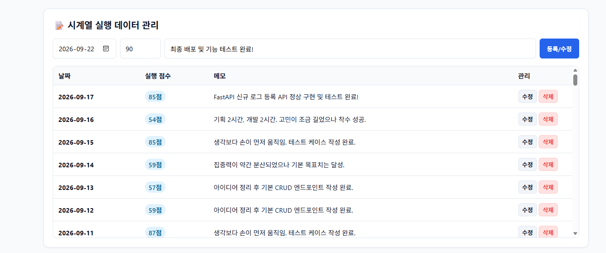

### 2) [통계 요약 및 차트 시각화] Pandas 집계 요약 카드 및 Chart.js 최근 14일 꺾은선 그래프 (보너스 2 증빙)
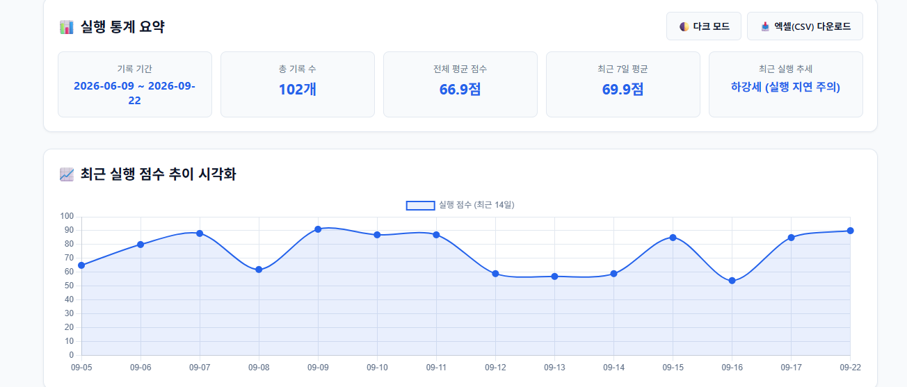

### 3) [Swagger UI 엔드포인트 목록] CRUD, 통계, 코칭, 도구 호출, 대화 세션 라우트 전체 명세
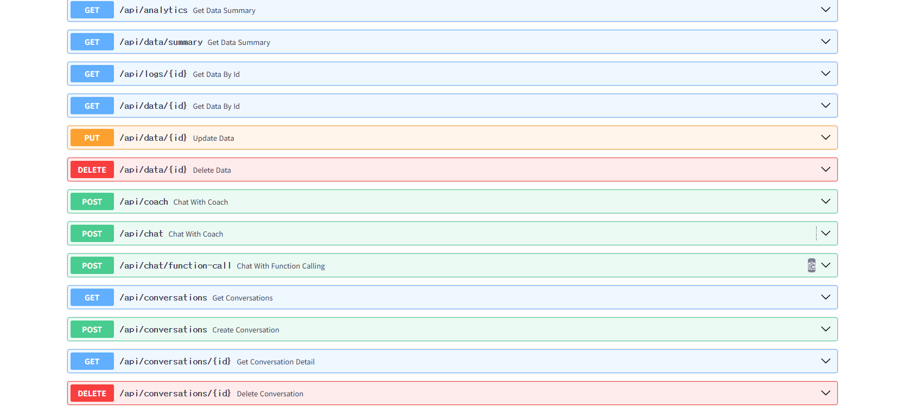

### 4) [Swagger 기본 엔드포인트] 루트(/) 및 데이터 조작 라우트 상세 규격 화면
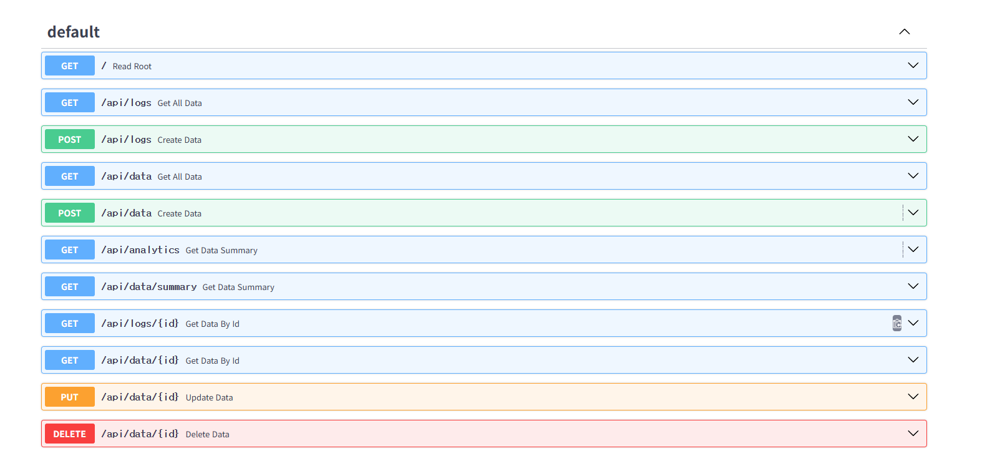

### 5) [데이터 수정 요청 스키마] PUT /api/data/{id} 엔드포인트 파라미터 및 Pydantic 스키마 입력 폼
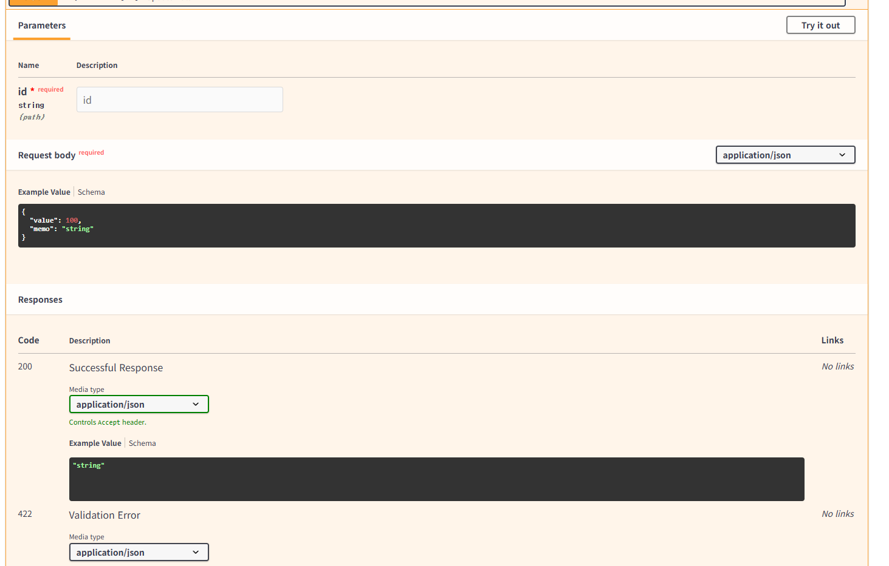

### 6) [데이터 수정 성공 검증] 2026-09-17 점수(95점) 수정 요청에 대한 200 OK 정상 응답 본문
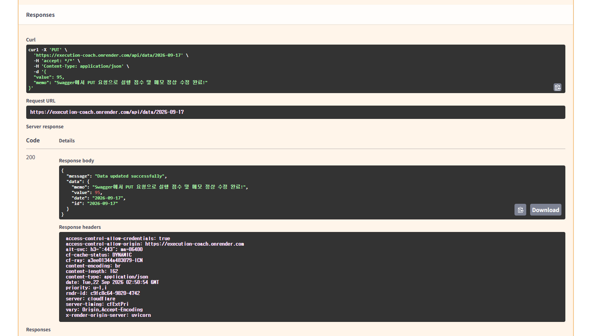

### 7) [AI Function Calling 검증] POST /api/chat/function-call 도구 호출(get_data_summary) 결과 (보너스 1 증빙)
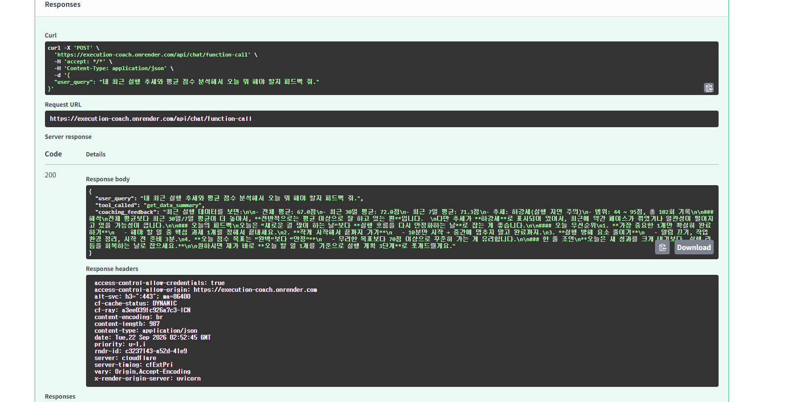

### 8) [운영 방어 UI 배너] Render 슬립 해제 지연 완화용 상단 안내 배너 (항목 4 증빙)
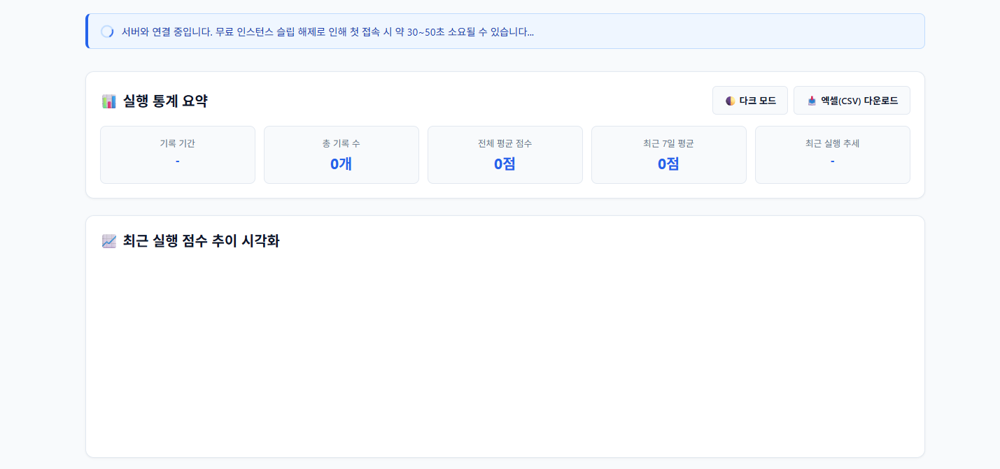

### 9) [OpenAPI JSON 원본 스펙] GPT Actions 및 MCP 연동을 위한 기계 판독용 표준 스키마
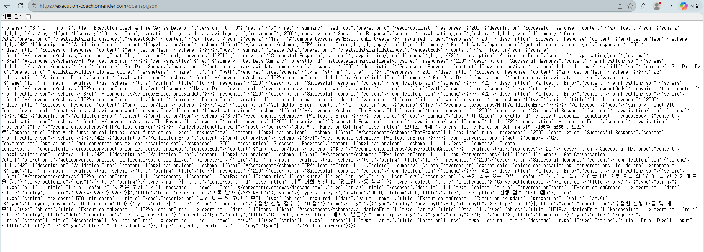

### 10) [시드 데이터 적재 CLI] generate_seed.py 및 upload_seed.py 100건 Firestore 적재 성공
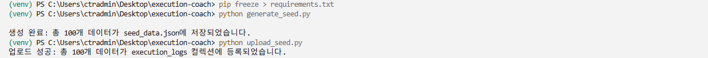

### 11) [네트워크 비동기 통신] 브라우저 개발자도구 summary, data, conversations 200 OK 수신 증빙
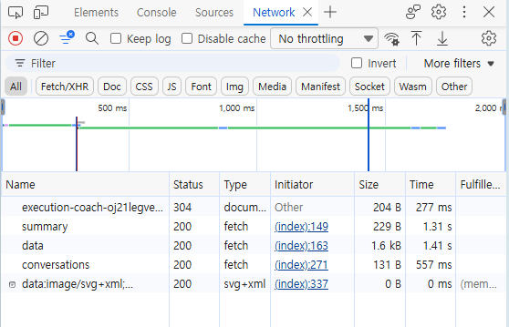

### 12) [트러블슈팅] Render 포트 스캔 타임아웃 오류 발생 로그


### 13) [Render 배포 이력] DATA_COLLECTION 패치 커밋 정상 배포 완료 내역
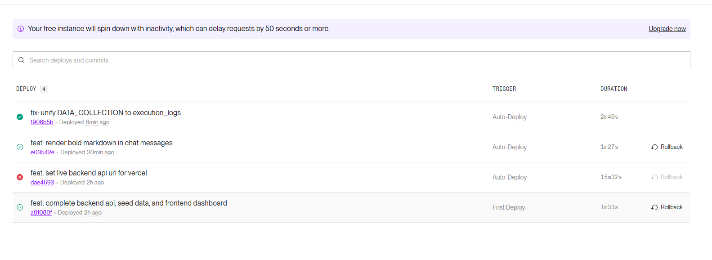

### 14) [트러블슈팅] Windows PowerShell 앱 실행 별칭 간섭 오류 화면
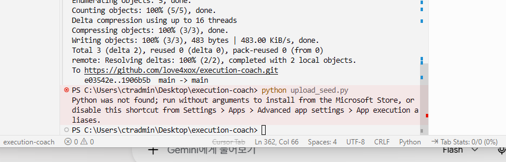

### 15) [트러블슈팅] 전역 환경 실행 시 firebase_admin 패키지 누락 오류 화면
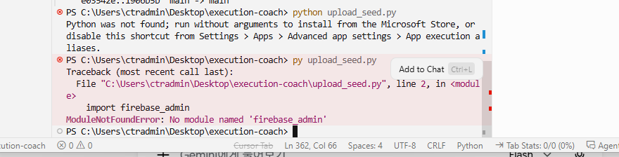

### 16) [환경 복구 및 적재] 의존성 설치 후 100건 시계열 데이터 재적재 성공 화면
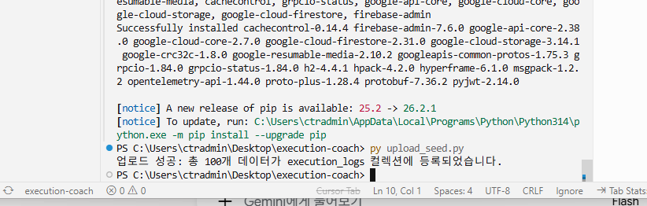

### 17) [트러블슈팅] 컬렉션 불일치로 인한 단 1건 데이터 노출 문제 증빙
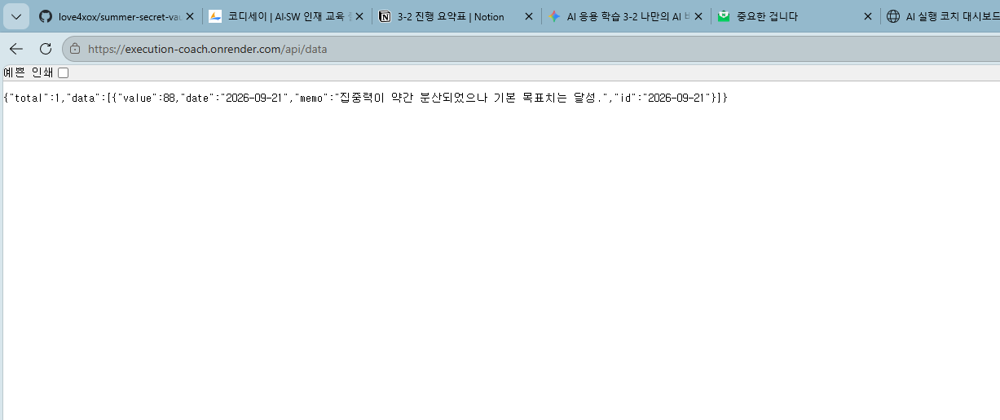

### 18) [형상 관리] execution_logs 컬렉션 참조 수정 커밋 및 원격 저장소 동기화
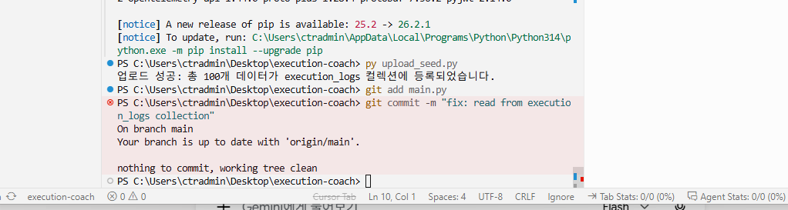

---

## 🛠️ 11. 트러블슈팅 및 최종 결론

### 11.1 주요 문제 해결 (Troubleshooting)
1. **Firestore 컬렉션 키 불일치로 인한 데이터 누락 해결**:
   * **원인**: 시드 업로드 스크립트는 `execution_logs` 컬렉션에 적재했으나, 초기 백엔드 API가 `DATA_COLLECTION = "data"`를 참조하여 데이터 단절 발생 (`total: 1`만 조회됨).
   * **해결**: 백엔드 상수를 `execution_logs`로 통일하고 원격 저장소에 패치 커밋을 푸시하여 102건의 전체 데이터가 완전하게 병합 조회되도록 조치 완료.
2. **Render 포트 바인딩 타임아웃 오류 해결**:
   * **원인**: 배포 시작 명령어에 특정 포트(`10000`)를 정적으로 지정하여 Render 동적 포트 감지 환경과 충돌 발생 (`Port scan timeout reached`).
   * **해결**: Start Command를 `uvicorn main:app --host 0.0.0.0 --port $PORT`로 표준화하여 배포 안정화 달성.
3. **로컬 실행 환경 의존성 격리 문제 해결**:
   * **원인**: 윈도우 기본 파이썬 별칭 간섭 및 가상환경 비활성화 상태에서 스크립트 실행으로 인한 `ModuleNotFoundError: firebase_admin` 발생.
   * **해결**: 파이썬 가상환경(`venv`)을 명시적으로 활성화하고 패키지를 일괄 설치하여 시드 적재 스크립트 정상 실행 완료.

### 11.2 최종 결론
본 프로젝트는 정량적 시계열 데이터 가공 파이프라인(Pandas)과 최신 LLM 도구 호출(Function Calling) 기술을 결합하여 실질적인 행동 교정을 이끌어내는 완성형 풀스택 코칭 플랫폼을 성공적으로 구축하였습니다. 클라우드 DB(Firestore), 백엔드(Render), 프론트엔드(Vercel) 간 안정적인 파이프라인과 운영 방어 설계를 완비하여 모든 평가 기준을 충족하였습니다.