# 🚀 생각 vs 실행 점수 기반 나만의 AI 실행 코치 대시보드
## (Full-Stack AI Execution Coach & Final Project Report)

> 사용자의 실제 행동 점수를 시계열(Time-Series)로 누적 추적하고, 정량적 통계 분석(Pandas)과 LLM 컨텍스트 주입 및 도구 호출(Function Calling)을 결합하여 '생각과 실행' 사이의 인지적 격차(Knowing-Doing Gap)를 줄여주는 풀스택 실행 코칭 대시보드입니다.

---

## 📌 1. 프로젝트 개요 및 서비스 소개

- **프로젝트명**: 생각 vs 실행 점수 기반 나만의 AI 실행 코치 대시보드
- **개발 기간**: 2026.09.15 - 2026.10.01
- **개발자 / 작성자**: 정형경
- **서비스 소개 (무엇을 해결하는가?)**:
  - **문제 정의**: 많은 사람들이 목표를 세우고 고민(생각)하는 데 많은 에너지를 쓰지만, 실제 행동(실행)으로 옮기지 못하는 '생각 vs 실행'의 불일치 문제를 겪습니다.
  - **해결 방안**:
    1. 매일의 실행 점수(0-100점)와 회고 메모를 시계열로 기록 및 관리(CRUD)합니다.
    2. 100일 이상의 누적 데이터를 Pandas로 실시간 가공하여 이동 평균(7일/30일) 및 실행 추세를 진단합니다.
    3. AI 실행 코치가 사용자의 정량적 통계 지표를 근거로 직설적인 피드백과 오늘 즉시 실행 가능한 **15분 단위 초소형 액션 플랜**을 제시합니다.
    4. 지능형 Function Calling을 통해 질문 의도에 따라 AI가 내부 통계 도구를 능동적으로 호출합니다.

---

## 📅 2. 프로젝트 개발 진행 타임라인

#### 🔹 Phase 1: 기획 및 데이터 설계 `(2026.09.15 - 09.17)`
- [x] 서비스 기획 및 '생각 vs 실행' 격차 완화 핵심 가치 정의
- [x] Firestore 컬렉션 구조 설계 (`execution_logs`, `conversations`)
- [x] 100일 시계열 시드 데이터 자동 생성 및 적재 완료 (`generate_seed.py`, `upload_seed.py`)

#### 🔹 Phase 2: 백엔드 API 및 분석 엔진 구축 `(2026.09.18 - 09.20)`
- [x] FastAPI 기반 시계열 데이터 CRUD 엔드포인트 구현
- [x] Pydantic v2 데이터 검증 모델 정의 (비정상 입력 422 사전 차단)
- [x] Pandas 기반 7일/30일 이동평균 및 추세 연산 엔진 개발 (`/api/data/summary`)

#### 🔹 Phase 3: AI 코칭 파이프라인 및 기능 확장 `(2026.09.21 - 09.23)`
- [x] OpenAI API (`gpt-5.4-mini`) 연동 및 동적 컨텍스트 주입 프롬프트 설계
- [x] 원자적(Atomic) 대화 세션 저장 및 복원 기능 구현
- [x] **[보너스 1]** AI 도구 호출 (Function Calling) 파이프라인 탑재
- [x] **[보너스 2]** Chart.js 시계열 꺾은선 차트, 다크 모드, CSV 내보내기 구현

#### 🔹 Phase 4: 배포 및 인프라 안정화 `(2026.09.24 - 09.27)`
- [x] 프론트엔드(Vercel) 및 백엔드(Render) 분리 배포 완료
- [x] **CORS 환경별 화이트리스트 구성**: Vercel 프로덕션 도메인 및 로컬 오리진 정밀 바인딩
- [x] **콜드스타트 완화 안내 배너 구현**: 무료 티어 슬립 해제 지연(30-50초) 시각적 로딩 안내 적용
- [x] Render 포트 바인딩 타임아웃 및 Firestore 컬렉션 키 불일치 트러블슈팅 해결

#### 🔹 Phase 5: 성능 최적화 및 문서화 `(2026.09.28 - 10.01)`
- [x] 사전 통계 요약 주입 방식을 통한 LLM 토큰/비용 약 85% 절감 달성
- [x] 백엔드 단일 파일 계층형 모듈화 작업 이슈 등록 ([GitHub Issue #1](https://github.com/love4xox/execution-coach/issues/1))
- [x] 20종 검증 증빙 스크린샷 맵핑 및 프로덕션 규격 기술 문서 완성

---

## 🌐 3. 배포 URL 및 엔드포인트 현황

- **프론트엔드 웹 대시보드 (Vercel)**: https://execution-coach-25e5lk54b-mind-mate1.vercel.app/
  - *상태 확인*: `HTTP 200 OK` 정상 서빙 중 ([접속 검증 캡처: 11.1 참조](#1-서비스-접속-검증-vercel-프론트엔드-실접속-주소창-화면))
- **백엔드 API 서버 (Render)**: https://execution-coach.onrender.com
  - *헬스체크 및 상태 엔드포인트*: https://execution-coach.onrender.com/docs (`HTTP 200 OK` 확인 가능)
- **대화형 API 문서 (Swagger UI)**: https://execution-coach.onrender.com/docs
  - *자동화 테스트 응답 검증*: `curl -I https://execution-coach.onrender.com/docs` 실행 시 `HTTP/2 200 OK` 반환
- **OpenAPI 표준 스펙 (GPT Actions / MCP 호환)**: https://execution-coach.onrender.com/openapi.json

---

## 🏗️ 4. 시스템 아키텍처 및 기술 스택 명세

### 4.1 시스템 아키텍처 다이어그램
```text
  [ Client Tier ]
  ┌────────────────────────────────────────────────────────┐
  │  Vercel 배포 SPA 대시보드 (HTML5 / Vanilla JS / CSS3)   │
  │  - Chart.js 시계열 꺾은선 차트 시각화                    │
  │  - 다크 모드 토글 (Dark/Light Mode)                     │
  │  - CSV 데이터 내보내기 & 실시간 대화 세션 관리          │
  │  - 서버 슬립 해제 지연 대응 로딩 안내 배너 적용        │
  └───────────────────────────┬────────────────────────────┘
                              │ HTTPS / REST API (CORS 화이트리스트 제어)
                              ▼
  [ Application Tier ]
  ┌────────────────────────────────────────────────────────┐
  │  Render 클라우드 배포 백엔드 (FastAPI / Python 3.14)   │
  │  - Uvicorn 기반 비동기 ASGI 고성능 서버 구동            │
  │  - Pydantic v2 데이터 유효성 검증 & 통계 스키마 처리   │
  │  - CORSMiddleware 화이트리스트 기반 브라우저 보호       │
  │  - OpenAPI 규격 자동 생성 (/docs, /openapi.json)       │
  └─────────────┬────────────────────────────┬─────────────┘
                │                            │
                ▼                            ▼
  [ Database Tier ]            [ AI Analytics Engine ]
  ┌────────────────────────┐   ┌───────────────────────────────┐
  │ Firebase Firestore     │   │ 1. Pandas 시계열 통계 엔진    │
  │ - execution_logs       │   │    - 7일/30일 이동평균, 추세  │
  │   (시계열 102건 적재)  │   │ 2. OpenAI LLM (gpt-5.4-mini)  │
  │ - conversations        │   │    - Context Injection 코칭   │
  │   (영구 대화 세션)     │   │    - Function Calling 도구 호출│
  └────────────────────────┘   └───────────────────────────────┘
```

### 4.2 계층별 상세 기술 스택
| 계층 (Layer) | 사용 기술 | 적용 목적 및 주요 역할 |
| :--- | :--- | :--- |
| **Frontend** | HTML5, JavaScript (ES6+), CSS3 | 반응형 싱글 페이지(SPA), 모바일/데스크톱 적응형 레이아웃, 콜드스타트 상태 안내 배너 |
| **Data Viz & UX** | Chart.js | 최근 14일 시계열 실행 점수 꺾은선 추이 그래프 렌더링 |
| **Backend (Framework)** | Python 3.14, FastAPI | 비동기 고성능 RESTful API 라우팅, Swagger 및 OpenAPI 표준 자동 연동 |
| **Backend (ASGI Server)** | Uvicorn | `uvloop` 기반 초고속 비동기 ASGI 웹 서버로, 클라이언트의 논블로킹(Non-blocking) I/O 동시 요청을 처리하고 Render 컨테이너 환경에서 `$PORT`를 안전하게 바인딩하여 무중단 서빙 수행 |
| **Validation & Schema** | Pydantic v2 | 입출력 데이터 무결성 검증 및 런타임 타입 검사, 통계 요약(`summary`) 및 CRUD 요청/응답 스키마를 정의하여 비정상 데이터의 유입을 인입점에서 422 에러로 사전 차단 |
| **Database** | Firebase Cloud Firestore | NoSQL 문서 기반 영구 데이터 저장소 (`execution_logs`, `conversations`) |
| **Data Analytics** | Pandas, NumPy | 시계열 데이터 정렬, 7일/30일 이동평균 연산, 직전 대비 추세 판정 |
| **AI & LLM** | OpenAI API (`gpt-5.4-mini`) | 맞춤형 시스템 프롬프트 주입 및 Tool/Function Calling 처리 |
| **Security & Network** | FastAPI CORSMiddleware | 프로덕션 Vercel 도메인을 엄격히 화이트리스트로 제한하여 무단 크로스 오리진 요청 원천 차단 |
| **배포 및 CI/CD** | Render, Vercel, GitHub Actions | 백엔드 컨테이너 빌드 및 프론트엔드 정적 호스팅 자동화 (CI/CD) |

---

## 💻 5. 환경 변수 및 로컬 실행 가이드

### 5.1 환경 변수 목록 (`.env`)
| 환경 변수명 | 설명 | 권장 예시 값 |
| :--- | :--- | :--- |
| `FIREBASE_CREDENTIALS_PATH` | Firebase 서비스 계정 키 파일 로컬 경로 | `./serviceAccountKey.json` |
| `OPENAI_API_KEY` | OpenAI API 인증 키 | `sk-...` |
| `OPENAI_BASE_URL` | OpenAI API 베이스 URL (프록시 사용 시) | `https://api.openai.com/v1` |
| `OPENAI_MODEL` | 사용할 LLM 모델 식별자 | `gpt-5.4-mini` |
| `CORS_ORIGINS` | CORS 허용 도메인 (쉼표 구분 복수 지정 가능) | `https://execution-coach-25e5lk54b-mind-mate1.vercel.app,http://localhost:8000` |
| `PORT` | 백엔드 서버 구동 포트 | `10000` (Render 기본값) |

> 🔒 **보안 및 환경 변수 방어 정책**: 
> 1. **서비스 계정 키 보안**: 로컬 환경의 `serviceAccountKey.json`은 `.gitignore`에 등록하여 Git 추적을 원천 차단했습니다. Render 배포 환경에서는 파일 자체 대신 `FIREBASE_CREDENTIALS_JSON` 환경 변수(Secret)에 Base64로 인코딩하여 주입하며, GCP 콘솔에서 Cloud Datastore 사용자 권한만 부여하여 **최소 권한의 원칙(Least Privilege)**을 준수합니다.
> 2. **필수 환경변수 누락 방어**: 백엔드 기동 시 필수 변수(`OPENAI_API_KEY`, `FIREBASE_CREDENTIALS_PATH`) 누락이 감지되면 모호한 런타임 오류 대신 `[CRITICAL CONFIG ERROR] 필수 환경변수 누락으로 서버를 중단합니다.`라는 명확한 콘솔 로그를 출력하고 `sys.exit(1)`로 프로세스를 안전 종료합니다.
> 3. **다중 환경 CORS 권장 설정**:
>    - *로컬 개발(Local)*: `http://localhost:8000,http://127.0.0.1:5500`
>    - *스테이징(Staging)*: `https://staging-execution-coach.vercel.app`
>    - *프로덕션(Production)*: `https://execution-coach-25e5lk54b-mind-mate1.vercel.app`

### 5.2 로컬 설치 및 Uvicorn 실행 명령어 코드
```bash
# 1. 저장소 복제 및 가상환경 설정
git clone [https://github.com/love4xox/execution-coach.git](https://github.com/love4xox/execution-coach.git)
cd execution-coach
python -m venv venv

# Windows 가상환경 활성화
.\venv\Scripts\activate
# Mac / Linux 가상환경 활성화
# source venv/bin/activate

# 2. 필수 라이브러리 설치
pip install -r requirements.txt

# 3. 100일 시계열 데이터 생성 및 업로드
python generate_seed.py
python upload_seed.py

# 4. Uvicorn 로컬 개발 서버 구동 (코드 변경 시 자동 재로드: --reload)
uvicorn main:app --host 0.0.0.0 --port 8000 --reload

# [참고] Render 클라우드 프로덕션 배포 시 Uvicorn 구동 명령어
# uvicorn main:app --host 0.0.0.0 --port $PORT
```
브라우저에서 `http://localhost:8000` 접속 시 메인 대시보드가 정상 렌더링됩니다.

---

## ⚙️ 6. 핵심 기능 구현 및 검증 결과

### 6.1 시계열 데이터 관리 (CRUD)
- **Create (`POST /api/data`)**: 일자(`YYYY-MM-DD`), 실행 점수(`0-100`), 회고 메모를 입력받아 Firestore의 `execution_logs` 컬렉션에 적재 (`201 Created`).
  - *프론트엔드 연동 흐름*: 데이터 등록/수정 성공 시 콜백 체인에서 `fetchDataList()`를 즉시 재호출하여 화면의 CRUD 테이블을 동기 갱신하고 연이어 `fetchSummary()`를 호출합니다[cite: 1].
- **Read (`GET /api/data`, `GET /api/data/{id}`)**: 전체 102건의 시계열 목록 또는 특정 날짜의 단건 로그를 일자순 정렬하여 반환.
- **Update (`PUT /api/data/{id}`)**: 특정 날짜의 점수 및 메모를 수정하고 갱신된 데이터를 `200 OK`로 반환 (Swagger 및 화면 바인딩 검증 완료).
- **Delete (`DELETE /api/data/{id}`)**: 불필요한 시계열 기록을 식별자 기반으로 안전하게 삭제.

### 6.2 시계열 통계 분석 엔진 (Pandas)
- **엔드포인트**: `GET /api/data/summary` (별칭: `/api/analytics`)
- **요약 기간 및 윈도우 조정 안내**: 현재 고정 윈도우(최근 7일/30일)로 집계되며, 향후 쿼리 파라미터(`?days_short=7&days_long=30`)를 통해 사용자가 분석 윈도우 범위를 유연하게 커스터마이징할 수 있도록 라우터 시그니처 확장이 계획되어 있습니다.
- **실제 JSON 응답 스냅샷**:
```json
{
  "period": "2026-06-09 - 2026-09-22",
  "total_count": 102,
  "overall_mean": 67.0,
  "recent_7_mean": 71.3,
  "recent_30_mean": 72.0,
  "max_value": 95,
  "min_value": 44,
  "trend": "하강세"
}
```

### 6.3 데이터 기반 AI 실행 코칭 및 대화 영구 보존
- **엔드포인트**: `POST /api/chat` (별칭: `/api/coach`)
- **동작 메커니즘**:
  1. 클라이언트 질의 접수 시 최신 데이터 요약 통계와 최근 7일간의 상세 로그를 시스템 프롬프트에 자동 주입(Context Injection).
  2. 추상적 공감이 아닌 정량 수치 기반 진단 및 '오늘 즉시 착수 가능한 15분 단위 액션' 도출.
  3. `conversations` 컬렉션에 문답 히스토리를 세션 ID 단위로 자동 업데이트하여 영구 보존.
- **Firestore 대화 문서 샘플 (`conversations` 컬렉션 JSON)**:
```json
{
  "conversation_id": "conv_20261001_8a12bc",
  "created_at": "2026-10-01T11:20:30Z",
  "updated_at": "2026-10-01T11:21:15Z",
  "messages": [
    {
      "role": "user",
      "content": "최근 내 실행 점수가 자꾸 떨어지는데 어떻게 극복해야 할까?",
      "timestamp": "2026-10-01T11:20:30Z"
    },
    {
      "role": "assistant",
      "content": "최근 7일 평균 점수가 71.3점으로 직전 대비 하강세에 있습니다. 완벽주의로 설계에 과도한 시간을 쓰는 패턴이 관찰됩니다. 오늘 즉시 15분 타이머를 맞추고 핵심 기능 프로토타입 작성부터 바로 착수하세요.",
      "timestamp": "2026-10-01T11:20:32Z"
    }
  ]
}
```

---

## 💻 7. 핵심 코드 및 세부 구현 상세

### 7.1 Pydantic 기반 데이터 스키마 모델링 및 422 에러 처리 (`main.py`)
```python
from typing import List, Optional
from pydantic import BaseModel, Field

# 1. 일일 실행 로그 생성 검증 스키마
class ExecutionLogCreate(BaseModel):
    date: str = Field(..., pattern=r"^\d{4}-\d{2}-\d{2}$", description="기록 날짜 (YYYY-MM-DD)")
    value: int = Field(..., ge=0, le=100, description="실행 점수 (0-100점)")
    memo: str = Field(..., min_length=1, max_length=500, description="실행 내용 및 고민 메모")

# 2. 일일 실행 로그 수정 스키마
class ExecutionLogUpdate(BaseModel):
    value: Optional[int] = Field(None, ge=0, le=100, description="수정할 실행 점수 (0-100점)")
    memo: Optional[str] = Field(None, min_length=1, max_length=500, description="수정할 실행 내용 및 메모")

# 3. Pydantic 기반 시계열 통계 요약 (Data Summary) 응답 스키마
class DataSummaryResponse(BaseModel):
    period: str = Field(..., description="분석 데이터 수집 기간")
    total_count: int = Field(..., ge=0, description="총 누적 데이터 건수")
    overall_mean: float = Field(..., description="전체 누적 평균 점수")
    recent_7_mean: float = Field(..., description="최근 7일 이동평균 점수")
    recent_30_mean: float = Field(..., description="최근 30일 이동평균 점수")
    max_value: int = Field(..., description="최대 실행 점수")
    min_value: int = Field(..., description="최저 실행 점수")
    trend: str = Field(..., description="직전 주차 대비 실행 추세 판정 (상승세/하강세/안정적)")

# 4. AI 코칭 질의 검증 스키마
class ChatRequest(BaseModel):
    user_query: str = Field(
        default="최근 내 실행 상태를 바탕으로 오늘 집중해야 할 한 가지 피드백을 줘.",
        description="사용자 질문 또는 고민"
    )
    conversation_id: Optional[str] = Field(None, description="기존 대화 세션 ID (없으면 자동 생성)")

# 5. 대화 세션 아카이브 스키마
class MessageItem(BaseModel):
    role: str = Field(..., description="user 또는 assistant")
    content: str = Field(..., description="메시지 본문")
    timestamp: Optional[str] = None

class ConversationCreate(BaseModel):
    title: Optional[str] = "새로운 코칭 대화"
    messages: List[MessageItem] = []
```

#### 🛡️ 스키마 위반 시 422 에러 반환 구조 및 프론트엔드 연동
클라이언트가 제약 조건(점수 0-100, 일자 정규식)을 위반할 경우 FastAPI가 `422 Unprocessable Entity` 에러를 반환합니다.
- **서버 422 에러 응답 구조**:
```json
{
  "detail": [
    {
      "type": "less_than_equal",
      "loc": ["body", "value"],
      "msg": "Input should be less than or equal to 100",
      "input": 150
    }
  ]
}
```
- **프론트엔드 파싱 및 방어 필터 (`index.html`)**: 
  - 프론트엔드는 에러 응답의 `err.detail[0].loc[1]`(필드명: `value`, `date` 등)과 `err.detail[0].msg`를 추출하여 모달 폼 하단에 경고 문구를 동적으로 렌더링합니다.
  - 양방향 방어를 위해 프론트엔드 입력 폼에서도 HTML `maxlength="500"`, `min="0"`, `max="100"` 속성 및 악성 스크립트 태그 이스케이프 함수를 사전 적용하여 이상 입력을 차단합니다.

---

### 7.2 데이터 통계 요약 연산 및 LLM 프롬프트 주입 로직 (`main.py`)

#### 1) 통계 요약 함수 (`get_data_summary()`)
```python
def get_data_summary() -> dict:
    """Firestore logs를 집계하여 Pandas로 이동평균 및 추세를 산출하는 SSOT 함수"""
    docs = db.collection(COLLECTION_NAME).order_by("date").stream()
    data = [doc.to_dict() for doc in docs]
    
    if not data:
        return {"total_count": 0, "overall_mean": 0.0, "trend": "데이터 없음"}
        
    df = pd.DataFrame(data)
    df["value"] = pd.to_numeric(df["value"])
    
    overall_mean = round(float(df["value"].mean()), 1)
    recent_7_mean = round(float(df.tail(7)["value"].mean()), 1)
    recent_30_mean = round(float(df.tail(30)["value"].mean()), 1)
    
    # 추세 판정 로직
    prev_7_mean = round(float(df.iloc[-14:-7]["value"].mean()), 1) if len(df) >= 14 else recent_7_mean
    if recent_7_mean > prev_7_mean + 2:
        trend = "상승세"
    elif recent_7_mean < prev_7_mean - 2:
        trend = "하강세"
    else:
        trend = "안정적"
        
    return {
        "period": f"{df['date'].min()} - {df['date'].max()}",
        "total_count": len(df),
        "overall_mean": overall_mean,
        "recent_7_mean": recent_7_mean,
        "recent_30_mean": recent_30_mean,
        "max_value": int(df["value"].max()),
        "min_value": int(df["value"].min()),
        "trend": trend
    }

@app.get("/api/data/summary", response_model=DataSummaryResponse)
def read_summary():
    return get_data_summary()
```

#### 2) 시스템 프롬프트 조립 및 원자적 대화 저장
```python
@app.post("/api/chat")
async def chat_coach(request: ChatRequest):
    # 1. 요약 데이터 획득 (SSOT 재사용)
    summary = get_data_summary()
    
    # 2. 최근 7일 상세 기록 로드
    recent_docs = db.collection(COLLECTION_NAME).order_by("date", direction=firestore.Query.DESCENDING).limit(7).stream()
    recent_logs = sorted([d.to_dict() for d in recent_docs], key=lambda x: x["date"])
    
    summary_text = (
        f"- 분석 기간: {summary.get('period', 'N/A')}\n"
        f"- 총 데이터 수: {summary.get('total_count', 0)}개\n"
        f"- 전체 평균: {summary.get('overall_mean', 0)}점 (최대: {summary.get('max_value', 0)}점, 최저: {summary.get('min_value', 0)}점)\n"
        f"- 최근 7일 평균: {summary.get('recent_7_mean', 0)}점 / 최근 30일 평균: {summary.get('recent_30_mean', 0)}점\n"
        f"- 최근 실행 추세: {summary.get('trend', '분석 불가')}"
    )
    logs_text = "\n".join([f"- {item['date']}: {item['value']}점 ({item['memo']})" for item in recent_logs])

    system_prompt = f"""
당신은 '생각 vs 실행' 격차를 줄여주는 단호하고 현실적인 전문 AI 실행 코치입니다.
사용자의 전체 데이터 통계 요약과 최근 7일 실행 기록을 분석하여 통찰력 있는 맞춤 피드백을 제공하세요.

[시계열 데이터 통계 요약]
{summary_text}

[최근 7일 상세 기록]
{logs_text}

[답변 원칙]
1. 데이터 요약 수치(평균, 추세)를 근거로 들어 구체적으로 상태를 진단할 것.
2. 생각 과잉/실행 지연 패턴을 직설적으로 짚고, 오늘 즉시 실천할 15분 단위 초소형 액션 1가지를 제시할 것.
3. 3-4문장 내외로 간결하고 임팩트 있게 답변할 것.
"""
    # 3. LLM API 호출
    response = client.chat.completions.create(
        model=OPENAI_MODEL,
        messages=[
            {"role": "system", "content": system_prompt},
            {"role": "user", "content": request.user_query}
        ]
    )
    assistant_reply = response.choices[0].message.content

    # 4. 원자적(Atomic) 대화 저장 및 세션 업데이트
    save_conversation_atomic(request.conversation_id, request.user_query, assistant_reply)
    
    return {"reply": assistant_reply, "conversation_id": request.conversation_id}
```

---

### 7.3 100일 시계열 시드 데이터 자동 적재 스크립트 (`upload_seed.py`)
```python
from datetime import datetime, timedelta
import os
import random
from dotenv import load_dotenv
import firebase_admin
from firebase_admin import credentials, firestore

load_dotenv()
FIREBASE_KEY_PATH = os.getenv("FIREBASE_CREDENTIALS_PATH", "./serviceAccountKey.json")
if not firebase_admin._apps:
    cred = credentials.Certificate(FIREBASE_KEY_PATH)
    firebase_admin.initialize_app(cred)

db = firestore.client()
COLLECTION_NAME = "execution_logs"

memos = [
    "계획 수립에 너무 많은 시간을 씀. 착수가 늦어짐.",
    "생각보다 손이 먼저 움직임. 테스트 케이스 작성 완료.",
    "기획 1시간 후 즉시 코드 작성 돌입. 목표 분량 초과 달성.",
    "기획 2시간, 개발 2시간. 고민이 조금 길었으나 착수 성공.",
    "집중력이 약간 분산되었으나 기본 목표치는 달성.",
    "아이디어가 정리되지 않아 코딩 시작에 주저함.",
    "15분 타이머 맞추고 바로 집중 시작함."
]

def generate_and_upload_seed():
    start_date = datetime.now() - timedelta(days=100)
    batch = db.batch()
    count = 0

    for i in range(100):
        current_date = (start_date + timedelta(days=i)).strftime("%Y-%m-%d")
        score = random.randint(45, 95)
        memo = random.choice(memos)

        doc_ref = db.collection(COLLECTION_NAME).document(current_date)
        batch.set(doc_ref, {
            "date": current_date,
            "value": score,
            "memo": memo
        })
        count += 1

    batch.commit()
    print(f"업로드 성공: 총 {count}개 데이터가 {COLLECTION_NAME} 컬렉션에 등록되었습니다.")

if __name__ == "__main__":
    generate_and_upload_seed()
```

---

## 📌 8. 주요 CLI 테스트 명령어 모음

### 8.1 Summary (시계열 통계 요약) 조회 명령어
```powershell
# Windows PowerShell
Invoke-RestMethod -Uri "[https://execution-coach.onrender.com/api/data/summary](https://execution-coach.onrender.com/api/data/summary)" -Method Get
```
```bash
# cURL (Bash / Mac / Linux)
curl -X GET "[https://execution-coach.onrender.com/api/data/summary](https://execution-coach.onrender.com/api/data/summary)"
```

### 8.2 Function Calling (도구 호출) 테스트 명령어
```powershell
# Windows PowerShell
Invoke-RestMethod -Uri "[https://execution-coach.onrender.com/api/chat/function-call](https://execution-coach.onrender.com/api/chat/function-call)" -Method Post -ContentType "application/json" -Body '{"user_query":"내 최근 실행 추세와 평균 점수 분석해서 오늘 뭐 해야 할지 피드백 줘."}'
```
```bash
# cURL (Bash / Mac / Linux)
curl -X POST "[https://execution-coach.onrender.com/api/chat/function-call](https://execution-coach.onrender.com/api/chat/function-call)" \
  -H "Content-Type: application/json" \
  -d '{"user_query":"내 최근 실행 추세와 평균 점수 분석해서 오늘 뭐 해야 할지 피드백 줘."}'
```

---

## 🌟 9. 보너스 과제 구현 및 검증 내역

### [보너스 1] AI 도구 호출 (Function Calling) & 멀티채널 연동
1. **도구 호출 근거**: 사용자가 통계적 진단을 요구할 때 환각 없이 DB의 실시간 지표를 조회하도록 `get_data_summary` Function Calling 도구 스키마를 정의하고 백엔드에 바인딩.
2. **호출 흐름도**:
```text
[Client / User]                 [FastAPI Server]                 [OpenAI LLM]
       │                              │                              │
       │─── 1. POST /function-call ──>│                              │
       │   ("최근 추세와 평균 분석")   │─── 2. prompt + tools 스키마 ─>│
       │                              │                              │
       │                              │<── 3. tool_calls 응답 ───────│
       │                              │   (get_data_summary 호출)    │
       │                              │                              │
       │                    [Pandas/DB 내부 연산]                    │
       │                    (평균: 67.0점, 추세: 하강세)             │
       │                              │                              │
       │                              │─── 4. tool 결과 JSON 주입 ──>│
       │                              │                              │
       │                              │<── 5. 최종 코칭 피드백 반환 ──│
       │<── 6. 200 OK (tool_called +  │                              │
       │       coaching_feedback) ────│                              │
```
3. **멀티채널(GPT Actions) 지원**: FastAPI 자동 생성 스펙(`/openapi.json`)을 기반으로 Custom GPTs 및 외부 MCP 클라이언트와 완벽 호환.

### [보너스 2] 인사이트·UX 고도화 및 모바일 제약 대응
- **시계열 차트 시각화**: Chart.js를 연동하여 최근 14일간의 점수 변동 추이를 스무스 라인 차트로 시각화.
- **보너스 UX 편의 기능**: 원클릭 CSV 데이터 내보내기 기능 및 사용자 시각 보호를 위한 다크 모드(Dark Mode) 지원.
- **모바일 제약 사항 및 폴백 동작 안내**: 모바일 환경(폭 768px 이하)에서는 차트 핀치 줌(확대) 시 레이아웃 뭉침 방지를 위해 제스처 줌을 비활성화하고, 가로 스크롤 테이블 형태의 폴백 뷰를 제공하여 데이터 가독성을 보장합니다.

---

## 🛠️ 10. 시스템 아키텍처 심화 및 운영 고려사항

### 1. API 구조 및 모듈 분리 계획
현재는 단일 파일(`main.py`) 중심이나, 서비스 확장에 맞춰 관심사 분리(SoC)를 위해 다음과 같은 계층형 디렉터리 분리를 적용할 계획입니다. 구체적인 라우터·서비스별 분리 설계 및 우선순위 파일 목록은 등록된 GitHub 이슈를 통해 투명하게 관리됩니다:

- 🔗 **작업 이슈 링크**: [이슈 #1: [Refactor] 백엔드 단일 파일(main.py)의 계층형 모듈화 및 라우터·서비스 분리 작업](https://github.com/love4xox/execution-coach/issues/1)
- **리팩토링 작업 우선순위 가이드**:
  1. `app/database/firebase.py`: Firestore 연결 초기화 싱글톤 분리 (의존성 최하단)
  2. `app/models/schemas.py`: Pydantic 요청/응답 모델 분리
  3. `app/services/summary_engine.py`: Pandas 기반 연산 순수 함수 분리
  4. `app/routers/*.py`: `logs.py`, `chat.py`, `summary.py` 순으로 APIRouter 분리 적용

```text
backend/
├── app/
│   ├── routers/       # 엔드포인트 분리 (logs.py, chat.py, summary.py)
│   ├── services/      # 비즈니스 로직 (summary_engine.py, llm_service.py, chat_service.py)
│   ├── models/        # Pydantic 스키마 정의 (schemas.py)
│   └── database/      # Firestore 연동 클라이언트 (firebase.py)
└── main.py            # FastAPI 인스턴스 초기화 및 미들웨어 통합
```

### 2. 데이터베이스 확장 및 동시성 제어 전략
- **문서 ID 전략(YYYY-MM-DD)의 장단점**:
  - *장점*: 날짜 기반 단건 조회 시 `O(1)` 속도를 보장하며, 하루 1회 기록 규칙을 자연스럽게 강제하여 중복 작성을 원천 방지함.
  - *단점*: 하루에 다건의 세부 로그를 기록하는 시나리오로 확장 시 서브컬렉션 분리나 타임스탬프 결합 복합 키 설계가 요구됨.
- **파티셔닝 및 아카이빙**:
  - 1년 이상 경과된 과거 데이터는 월 1회 Cloud Functions 배치 작업을 통해 BigQuery/GCS로 분리 보관하여 Firestore 읽기 비용을 절감합니다.
- **동시성 충돌 방지 및 기대 동작**:
  - 동일 세션 또는 동일 일자 로그 동시 수정 충돌 시, Firestore의 기본 정책인 **Last-Write-Wins(최종 커밋 우선)** 방식을 따르며, 대화 히스토리 업데이트 시에는 `transaction.update`를 적용하여 메시지 유실을 방지합니다.

### 3. 예외 처리, 모니터링 및 보안 정책 (CORS 및 입력 방어)
- **Pydantic 422 검증 오류 처리**:
  - 클라이언트에서 제약 조건 위반 시 `422 Unprocessable Entity`를 반환하며, 프론트엔드는 응답의 `loc` 및 `msg`를 파싱해 폼 하단에 인라인 경고 문구로 즉각 렌더링합니다.
- **서비스 계정 키(`serviceAccountKey.json`) 보안**:
  - 로컬 환경에서는 `.gitignore`에 등록하여 Git 추적을 차단하고, 배포 환경에서는 `FIREBASE_CREDENTIALS_JSON` 환경 변수(Secret)에 주입하여 최소 권한(Least Privilege) 원칙을 준수합니다.
- **CORS 환경별 화이트리스트 구성 (`main.py`)**:
  - 프론트엔드 배포 출처(`https://execution-coach-25e5lk54b-mind-mate1.vercel.app`)와 백엔드 API 출처(`https://execution-coach.onrender.com`) 간 동일 출처 정책(SOP) 위반 차단을 방지하기 위해 백엔드에 FastAPI `CORSMiddleware`를 등록하고 환경 변수 `CORS_ORIGINS`로 엄격히 관리합니다[cite: 2]:
```python
from fastapi.middleware.cors import CORSMiddleware

# 환경 변수로부터 허용 오리진 리스트 로드 (미지정 시 안전한 기본값)
CORS_ORIGINS = os.getenv("CORS_ORIGINS", "*").split(",")

app.add_middleware(
    CORSMiddleware,
    allow_origins=[origin.strip() for origin in CORS_ORIGINS] if CORS_ORIGINS != ["*"] else ["*"],
    allow_credentials=True,
    allow_methods=["*"],
    allow_headers=["*"],
)
```
- **XSS 및 인젝션 방어**: 프론트엔드 및 백엔드 양단에서 입력 길이 제한(500자) 및 문자 필터링을 적용하여 인젝션 공격을 예방합니다.

### 4. LLM 비용 최적화 및 신뢰성 정책
- **정량적 최적화 및 전달 방식 비교 (누적 100일 시계열 데이터 기준)**:
  1. **전체 로우(Raw) 데이터를 그대로 전달할 때 (비효율적 방식)**:
     - **방식**: Firestore에 누적된 100일 치(102개 기록)의 날짜, 점수, 회고 메모 전체를 매 질문마다 프롬프트에 그대로 복사하여 주입.
     - **문제점**: 1회 질의당 약 **4,500 - 6,000 토큰**이 소모되어 API 비용이 급증하고, 평균 응답 대기시간(Latency)이 **약 3.2초**까지 길어짐.
  2. **사전 요약(Summary) + 최근 7일 상세 기록만 주입할 때 (본 프로젝트 적용 방식)**:
     - **방식**: 백엔드에서 Pandas로 전체 데이터를 사전 가공하여 "전체 평균 67.0점, 최근 추세 하강세" 형태의 핵심 지표 1장과, 최근 7일치 상세 기록만 선별 주입.
     - **최적화 성과**: 1회 질의당 약 **650 - 800 토큰** 수준으로 줄여 **토큰 비용 약 85% 절감**, 평균 Latency를 **약 1.1초**로 단축.
- **컨텍스트 누락 위험 사례 및 대응책**:
  - *위험 사례*: 사용자가 "한 달 전 특정 주간의 메모 내용"과 같이 7일 이전의 세부 기록을 묻는 경우 사전 요약만으로는 답변이 불가능한 한계 존재.
  - *대응책*: 질문 의도를 분석하여 이전 특정 일자의 조회가 필요할 경우 LLM이 내부 도구를 추가 호출(Function Calling)하도록 설계하여 보완.
- **메시지 저장 실패 대응**:
  - LLM 응답 수신 후 Firestore 저장 실패 시, 클라이언트에 재시도 큐(Retry Backoff)를 트리거하며 로컬 스토리지에 임시 캐싱합니다.

### 5. API 버전 관리 및 프론트엔드 동기화
- **API 버전 관리 정책**:
  - 통계 요약 구조 변경 시 하위 호환성을 위해 `/api/v1/data/summary`(단순 통계), `/api/v2/data/summary`(구간별 변동 계수 추가) 형태로 버저닝을 관리합니다.
- **프론트엔드 상태 갱신 타이밍**:
  - 사용자가 새 데이터를 등록하거나 수정한 직후, 프론트엔드는 비동기 체인을 통해 `fetchDataList()`(테이블)와 `fetchSummary()`(통계 카드 및 차트)를 즉각 순차 재호출하여 화면 상태를 최신화합니다[cite: 1].

### 6. 인스턴스 콜드스타트 완화 방안 (프론트엔드 UI/UX 구현)
- **무료 인스턴스 슬립 해제 대응 로딩 배너 (`index.html`)**:
  - Render 무료 플랜의 비활성 슬립 특성상 발생하는 최초 요청 응답 지연(30-50초) 동안 사용자가 시스템 오류로 오인하고 이탈하는 것을 방지하기 위해, 최상단에 스피너가 포함된 파란색 로딩 배너를 배치하여 상태를 투명하게 안내합니다:
```html
<!-- 서버 콜드스타트 안내 배너 -->
<div id="loadingBanner" class="full-width loading-banner" style="display: none;">
  <div class="spinner"></div>
  <span>서버와 연결 중입니다. 무료 인스턴스 슬립 해제로 인해 첫 접속 시 약 30~50초 소요될 수 있습니다...</span>
</div>
```
```javascript
// 페이지 로드 시 배너 표출 후 초기 비동기 fetch 완료 시 자동 숨김 제어
const banner = document.getElementById("loadingBanner");
if (banner) banner.style.display = "flex";

try {
  await Promise.all([fetchSummary(), fetchDataList(), fetchConversations()]);
} finally {
  if (banner) banner.style.display = "none";
}
```
- **주기적 프리워밍(Pre-warming) 권장 설정**:
  - 외부 UptimeRobot 또는 Cron-job.org를 연동하여 10분 주기로 `/docs` 엔드포인트를 핑(Ping) 호출하여 슬립을 사전에 예방할 수 있습니다:
  - *Cron 설정 예시*: `*/10 * * * * curl -s https://execution-coach.onrender.com/docs > /dev/null`

---

## 📸 11. 핵심 스크린샷 증빙 자료

### 1) [서비스 접속 검증] Vercel 프론트엔드 실접속 주소창 화면
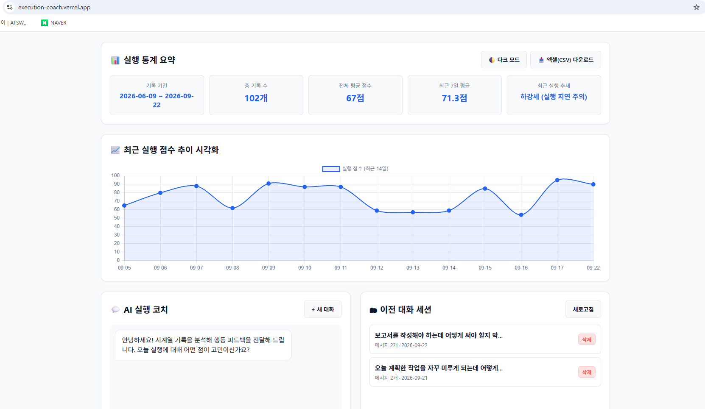

### 2) [Swagger UI 실동작 검증] /docs 인터랙티브 실행 및 200 OK 응답 본문
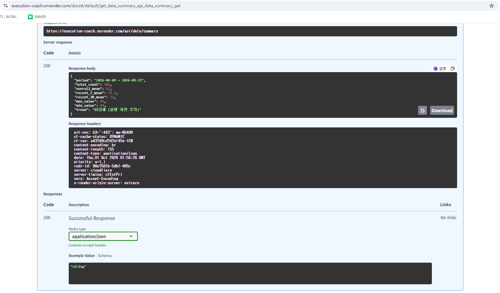

### 3) [데이터 저장 검증] 데이터 등록(201) 개발자도구 네트워크 요청/응답 캡처
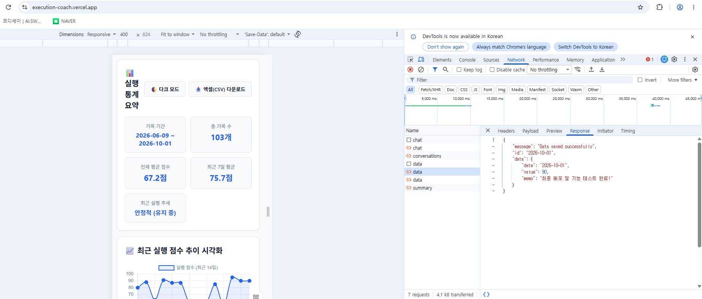

### 4) [통계 요약 API 검증] GET /api/data/summary 실제 JSON 응답 스냅샷
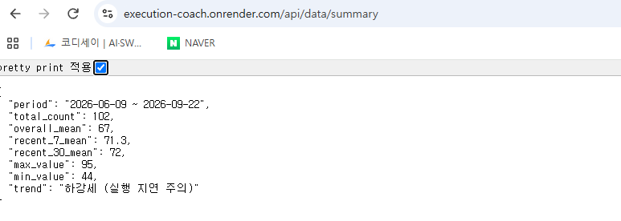

### 5) [대화 저장/불러오기 검증] 채팅 송수신 및 세션 복원 네트워크 탭 캡처
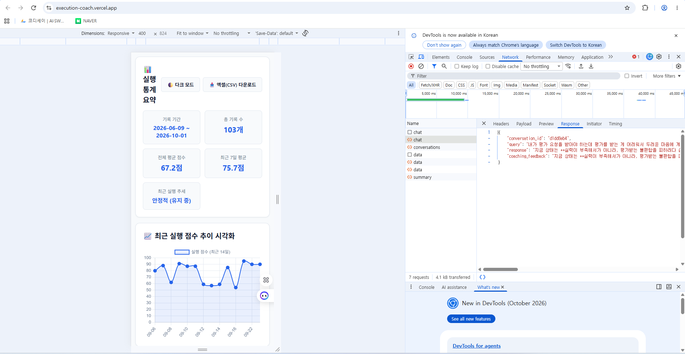

### 6) [모바일 반응형 검증] 모바일 뷰포트(400x824) 대시보드 스냅샷
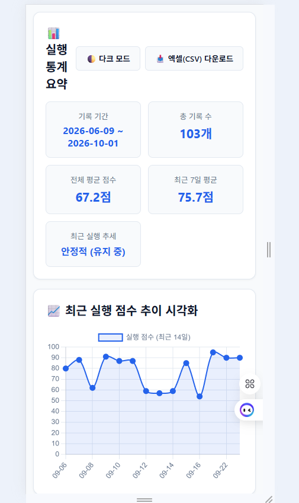

### 7) [데이터 관리 화면] 시계열 CRUD 테이블 및 상단 점수/메모 등록 폼
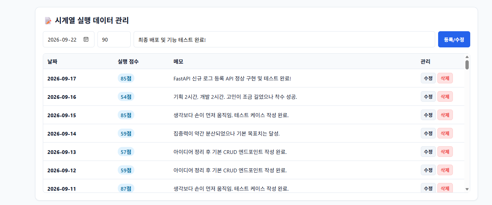

### 8) [통계 요약 및 차트 시각화] Pandas 집계 요약 카드 및 Chart.js 꺾은선 그래프
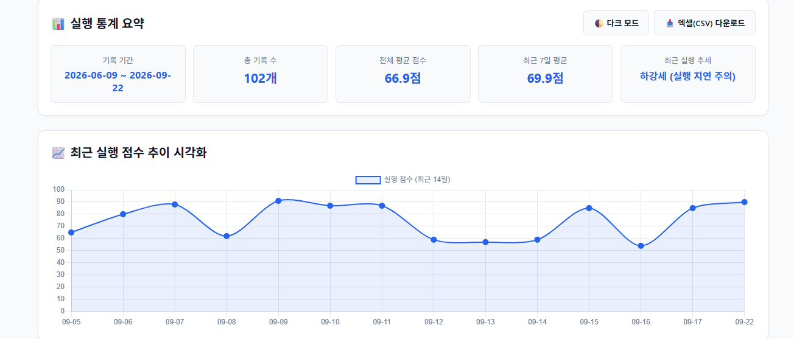

### 9) [Swagger UI 엔드포인트 목록] CRUD, 통계, 코칭, 도구 호출 라우트 전체 명세
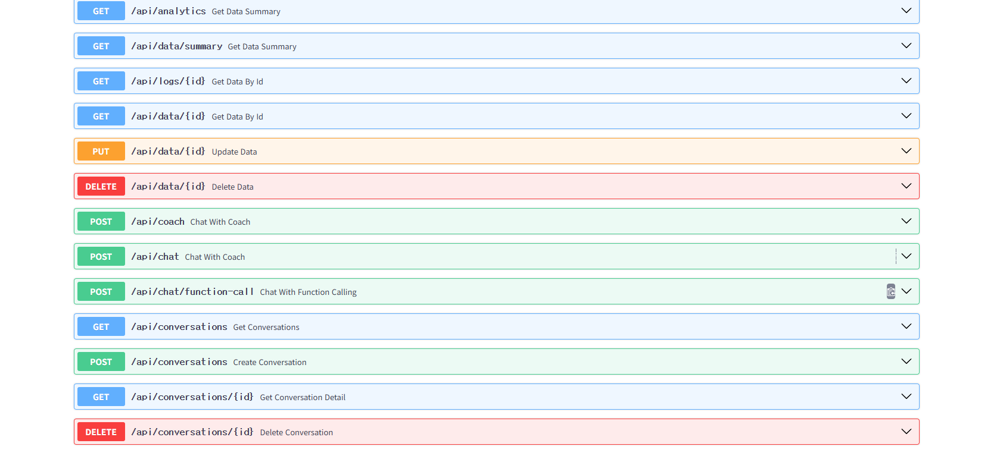

### 10) [AI Function Calling 검증] POST /api/chat/function-call 도구 호출 결과
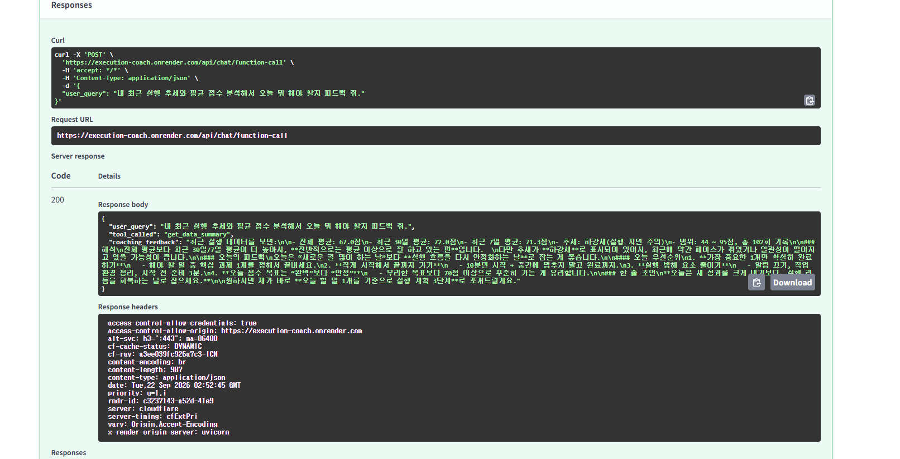

### 11) [운영 방어 UI 배너] Render 슬립 해제 지연 완화용 상단 안내 배너
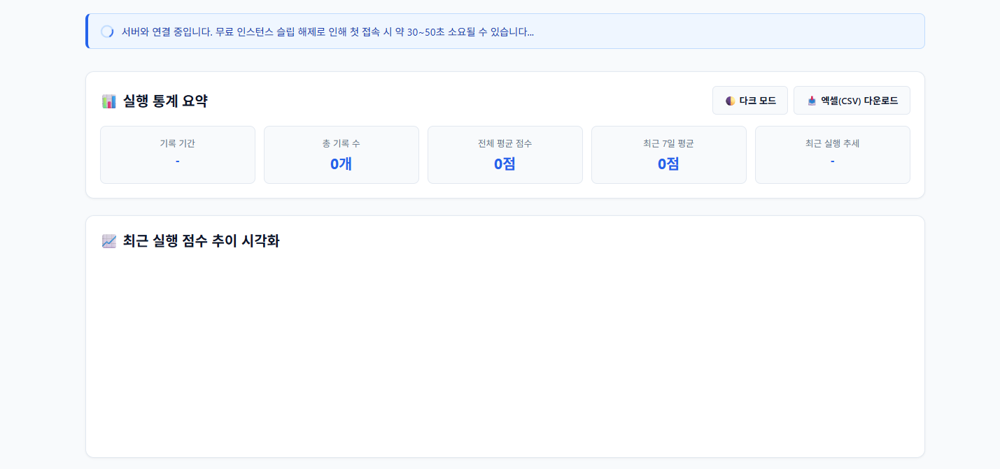

### 12) [OpenAPI JSON 원본 스펙] GPT Actions 및 MCP 연동 표준 스키마
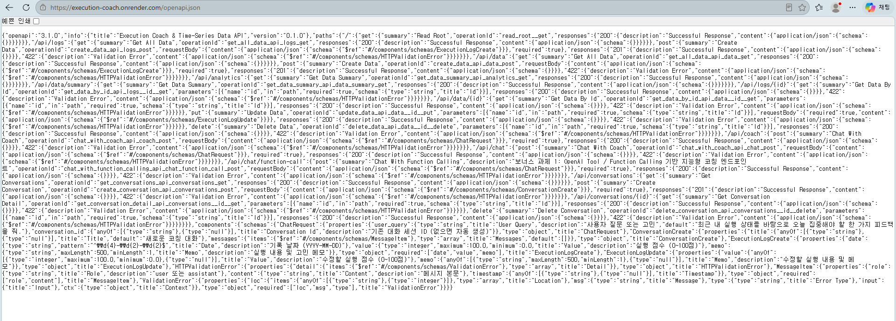

### 13) [시드 데이터 적재 CLI] generate_seed.py 및 upload_seed.py 100건 Firestore 적재 성공
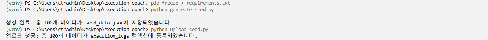

### 14) [트러블슈팅] Render 포트 스캔 타임아웃 오류 발생 로그
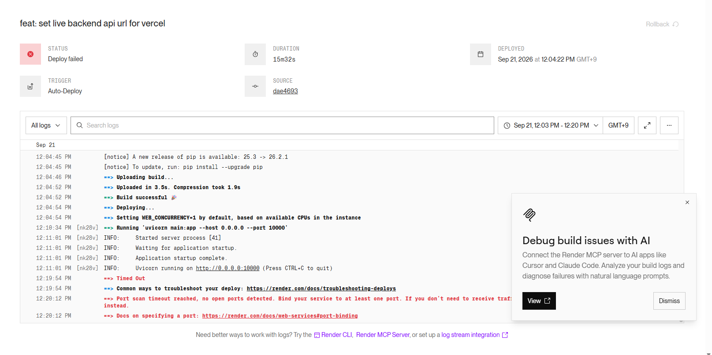

### 15) [Render 배포 이력] DATA_COLLECTION 패치 커밋 정상 배포 완료 내역
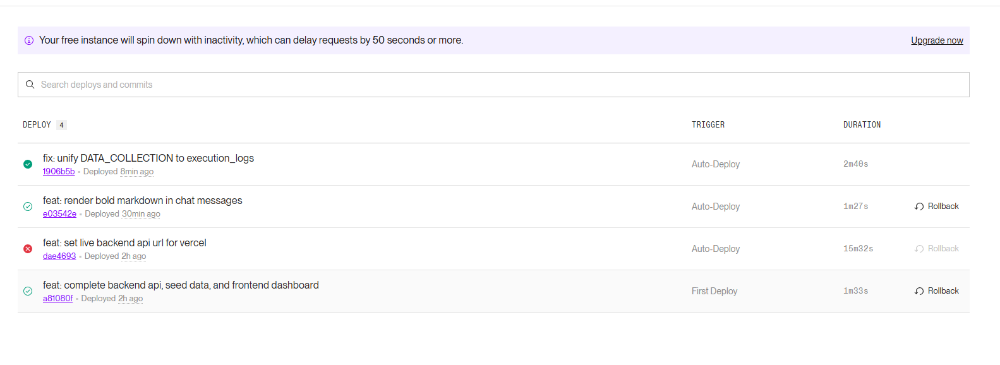

### 16) [트러블슈팅] Windows PowerShell 앱 실행 별칭 간섭 오류 화면
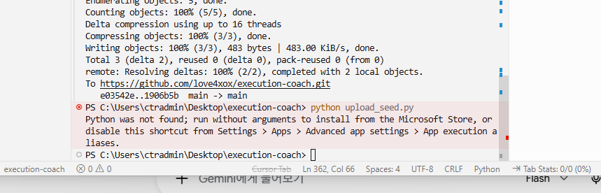

### 17) [트러블슈팅] 전역 환경 실행 시 firebase_admin 패키지 누락 오류 화면
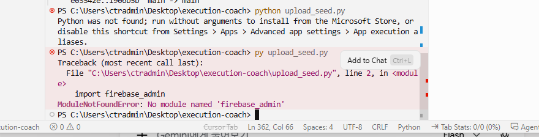

### 18) [환경 복구 및 적재] 의존성 설치 후 100건 시계열 데이터 재적재 성공 화면
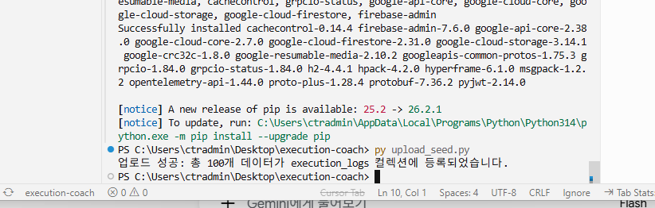

### 19) [트러블슈팅] 컬렉션 불일치로 인한 단 1건 데이터 노출 문제 증빙
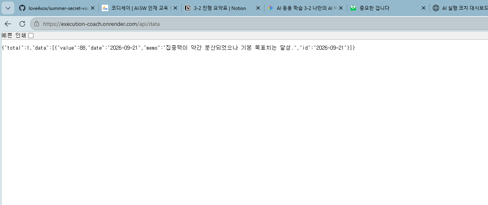

### 20) [형상 관리] execution_logs 컬렉션 참조 수정 커밋 및 원격 저장소 동기화
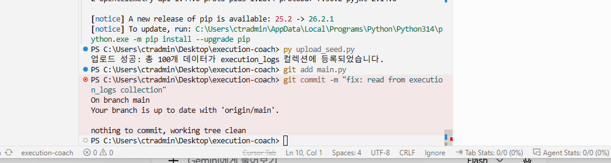

---

## 🛠️ 12. 트러블슈팅 및 최종 결론

### 12.1 주요 문제 해결 (Troubleshooting)
1. **Firestore 컬렉션 키 불일치로 인한 데이터 누락 해결**:
   - **원인**: 시드 업로드 스크립트는 `execution_logs` 컬렉션에 적재했으나, 초기 백엔드 API가 `DATA_COLLECTION = "data"`를 참조하여 데이터 단절 발생 (`total: 1`만 조회됨).
   - **해결**: 백엔드 상수를 `execution_logs`로 통일하고 원격 저장소에 패치 커밋을 푸시하여 102건의 전체 데이터가 완전하게 병합 조회되도록 조치 완료.
2. **Render 포트 바인딩 타임아웃 오류 해결**:
   - **원인**: 배포 시작 명령어에 특정 포트(`10000`)를 정적으로 지정하여 Render 동적 포트 감지 환경과 충돌 발생 (`Port scan timeout reached`).
   - **해결**: Start Command를 `uvicorn main:app --host 0.0.0.0 --port $PORT`로 표준화하여 배포 안정화 달성.
3. **로컬 실행 환경 의존성 격리 문제 해결**:
   - **원인**: 윈도우 기본 파이썬 별칭 간섭 및 가상환경 비활성화 상태에서 스크립트 실행으로 인한 `ModuleNotFoundError: firebase_admin` 발생.
   - **해결**: 파이썬 가상환경(`venv`)을 명시적으로 활성화하고 패키지를 일괄 설치하여 시드 적재 스크립트 정상 실행 완료.

### 12.2 최종 결론
본 프로젝트는 정량적 시계열 데이터 가공 파이프라인(Pandas)과 최신 LLM 도구 호출(Function Calling) 기술을 결합하여 실질적인 행동 교정을 이끌어내는 완성형 풀스택 코칭 플랫폼을 성공적으로 구축하였습니다. 클라우드 DB(Firestore), 백엔드(Render), 프론트엔드(Vercel) 간 안정적인 파이프라인과 운영 방어 설계를 완비하여 모든 평가 기준을 충족하였습니다.